# [ADIF Processor](http://adifweb-env.eba-saseumwd.eu-west-2.elasticbeanstalk.com/)	🔗

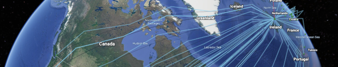

[ADIF Processor](http://adifweb-env.eba-saseumwd.eu-west-2.elasticbeanstalk.com/)	🔗 produces beautiful 
visualizations of your QSOs in [Google Earth](https://earth.google.com). Once you have generated a KML file 
from [ADIF Processor](http://adifweb-env.eba-saseumwd.eu-west-2.elasticbeanstalk.com/), use 
_Import KML file from computer_ via the map pin icon if using desktop [Google Earth](https://earth.google.com), 
otherwise click on the KML file in Android Google Earth to open the KML file.

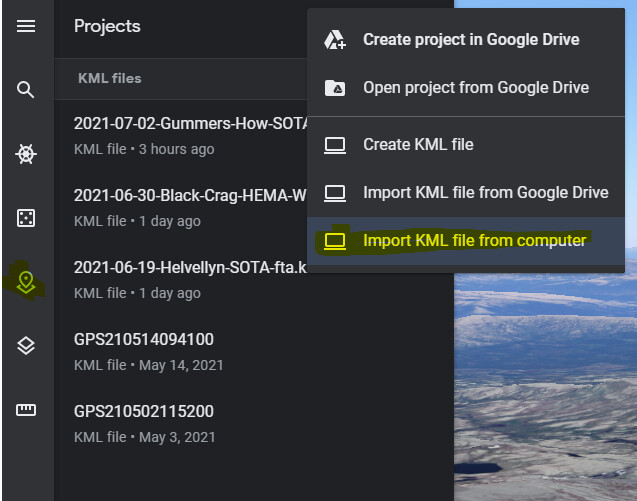

## Quick Start / TL;DR

Select your ADIF file on the [ADIF Processor upload form](http://adifweb-env.eba-saseumwd.eu-west-2.elasticbeanstalk.com/upload)	🔗  and click `Process...` 

<a href="https://urbancamo.github.io/images/simple-usecase.png">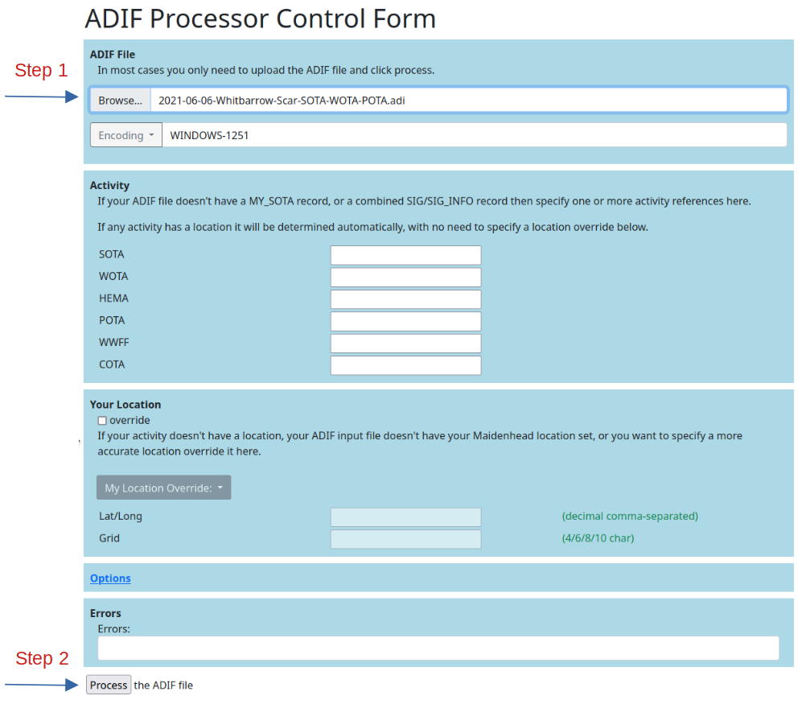
_Simple Use Case_

On a clean run you will be presented with three files:
- an enhanced ADIF file augmented with data from QRZ.com and activity references including
operator name and location.
- a [Google Earth](https://earth.google.com) Project (KML) file.
- a [Markdown](https://www.markdownguide.org/) table of contacts that can be pasted into a [Discourse](https://www.discourse.org/) server such as [SOTA Reflector](https://reflector.sota.org.uk/) or [WOTA Discourse](https://discourse.wota.xyz/). 

Any processing errors are displayed in the `Errors` text box and any callsigns for which a location could not be determined
as shown in the `Callsigns without Location` text box.

<a href="https://urbancamo.github.io/images/results.png">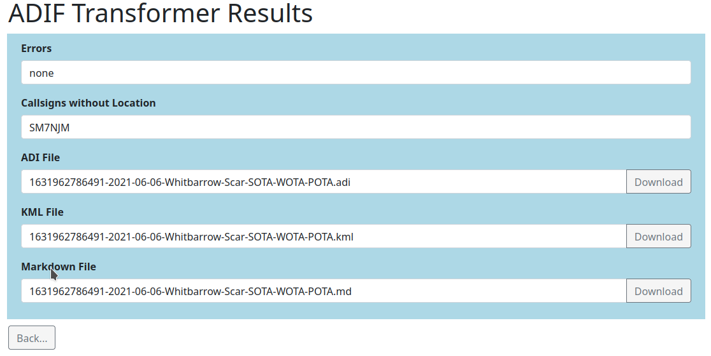
_Example Result Form_

If you are a fixed station you must have your location set in QRZ.com for the ADIF Processor to determine your location.

If your location isn't fixed (/P, /M, /A) and the ADIF input file contains a `MY_SOTA` reference, an activity reference in `SIG` `SIG_INFO` that has a location, your `MY_GRIDSQUARE` is set or your `LATITUDE` & `LONGITUDE` are set you are good to go. If not then let processor know where you are via the form, either by specifying an activity reference, or directly entering your location. 

An easy way to find your location is to right-click on [Google Maps](https://maps.google.com) to- the Latitude & Longitude can be pasted directly into the `Lat/Long` field.

## Releases

|Date|New Features|
|----|------------|
|07-SEP-2021|Support for Castles on the Air Activity References|
|18-SEP-2021|Supports Tropospheric Ducting & QO-100 Satellite Contacts|
|23-SEP-2021|Support for Lighthouses & Railways on the Air|
|26-SEP-2021|Initial Geolocation support via Nominatim|

***
## How It Works (or a bit more info)

Most folk are primarily interested in visualizing their QSOs in Google Earth, so we'll look at that first. 

There are a number of steps the ADIF Processor performs as it turns your ADIF file into a Google Earth KML project file.

### Determining Your Station Location

Lots here depends on whether you are operating from a fixed location or portable. 

If you are fixed the simplest solution is to ensure your QRZ.COM entry has a latitude & longitude for the most 
accurate location. 

If you aren't a fan of QRZ.COM you can override your location on the form either by specifying a latitude or longitude, 
or alternatively a Maidenhead Locator. 

If you want to make obscure your location a bit then specify a 6 or 8 character locator rather than the most accurate 
10 character version.

### Determining Other Station Locations

For each of your hard earned contacts ADIF Processor attempts to determine a location. It does this using a number of techniques, in order of accuracy:

1. A `LATITUDE` and `LONGITUDE` in the ADIF file.
2. Their Activity location (in the `SIG` and `SIG_INFO` or `SOTA_REF` fields of the ADIF input file).
3. Location in QRZ.com, preferring Latitude & Longitude if set over Maidenhead locator.
4. A maidenhead locator in the ADIF file `GRIDSQUARE`.
5. A Geocoding lookup is made via [Nominatim](https://nominatim.org/) and the OpenStreetMap database using any QRZ.com address data.

Note that a number of locations are regarded as _dubious_ or _invalid_ based on them being the default grid or 
latitude/longitude location in QRZ.com. In these cases unless an override location is specified in the input ADIF file 
a Geocoding lookup is made to determine the station location.

#### Stations without a location

Where no location can be determined a warning is issued, and the station isn't added to the Google Earth KML file. 
You can correct this by adding an activity for the station, or by specifying their `LATITUDE` and `LONGITUDE` in the 
ADIF input file or their `GRIDSQUARE` reference.

### 2. Adding Station Information from QRZ.COM

In order to enrich the ADIF output file, and provide more information when you click on a station icon in Google Earth, 
a lookup is made for additional station information from [QRZ.COM](https://qrz.com). 

The initial lookup is for the callsign as logged, but for some callsigns more work is required to determine the information.

The worst case is a portable operator abroad. It is unlikely the operator has created a specific QRZ.COM page for 
this callsign. I'll use examples to show how the application tries to determine the most accurate information.

When operating on holiday in Spain I used the callsign `EA7/M0NOM/P`. If you had a contact with me and used the ADIF 
Processor it would check QRZ.COM for the following callsign variants in order:

- `EA7/M0NOM/P`
- `EA7/M0NOM`
- `M0NOM/P`
- `M0NOM`

The UK complicates this a little more, as a Scottish operator `MM0XRT` activating a HEMA summit in Wales would be `MW0XRT/P`. In this case QRZ.COM would be queried with UK country callsign variants:

- `MW0XRT/P`
- `MW0XRT`
- `M0XRT/P`
- `M0XRT`
- `MM0XRT/P`
- `MM0XRT`
- `MI0XRT/P`
- `MI0XRT`
- `MD0XRT/P`
- `MD0XRT`
- `MG0XRT/P`
- `MG0XRT`

As soon as a variant matches in QRZ.COM the search stops. I've almost certainly only scratched the surface on this process!

### 3. Selection of Station Icon

There are a number of icons that are used to mark a station, based on the station suffix and any 
activity that is associated with the station.

|Icon|Suffix|Activity|Description/Link|
|----|------|--------|-----------|
| House|none or /A| |At home or alternate address|
| Hiker|/P| |Portable|
| Sailing Boat|/MM| |Maritime Mobile|
| Car|/M| |Mobile|
| Mountain|/P|SOTA|[Summits on the Air](https://www.sota.org.uk/)|
| Red 'H'|/P|HEMA|[HuMPs Excluding Marilyns Award](http://hema.org.uk/)
| Park Bench|/P|POTA|[Parks on the Air](https://parksontheair.com/)
| Castle|/P|COTA|[World Castles Award Programme](http://www.wca.qrz.ru/ENG/main.html)
| Hiker following Trail|/P|WOTA|[Wainwrights on the Air](https://www.wota.org.uk/)
| Tree|/P|WWFF|[World Wide Flora & Fauna in Amateur Radio](https://wwff.co/)
| Marina| |LOTA|[International Lighthouse & Lightship Weekend](https://illw.net/)
| Rail| |ROTA|[Railways on the Air](https://rota.barac.org.uk/)

Stations are selectable on the Google Earth map, or by selecting the station in the project list. When you do this a panel if information about the station is displayed. If the operator has a picture on QRZ.COM this is displayed together with details of activity the station was participating in and the frequency and mode of contact.

The communication paths between stations are also selectable directly from the line drawn on the Google Earth visualization (noting that a 'shadow' dark gray line is also drawn to help with the visualization) or from the project list.

When you select a communication path a panel of information is displayed that contains both station callsigns, together with the date and time of the contact and the propagation mode. For `SKYWAVE` contacts the number of hops is displayed together with the bounce height, length of contact across the surface of the earth as well as the distance the predicted path of communication took.

### Drawing the QSO

ADIF Processor uses a simple propagation visualization technique based on an ideal antenna. For HF signals this gives an idea of the minimum number of hops your QSO would have needed to reach the target station.

### The Propagation Model

This is a very simple model designed to map both HF and VHF/UHF contacts.
I supports predicting `SKYWAVE`, `GROUNDWAVE` and `SPORADIC_E` propagation modes. You can specify `TROPOSPHERIC_DUCTING`
for contacts identified as using this propagation.

For HF it is assumed that the ionospheric reflection height is 350 km, and the radiation angle of the antenna is 6 degrees. This represents an antenna with a low radiation angle, such as a vertical. Six degrees is the lowest angle of propagation that ensure the signal doesn't bisect the surface of the earth as it rises from the originating station.

Where the distance between two stations using HF is short it is assumed that the communication path is `GROUNDWAVE`.

This is the logic applied in determining the propagation mode. Note that there can be considerable improvements made to this model, but any model is only ever going to be a 'best guess'.

If the frequency of signal is > 50 Mhz and the distance is < 400 km then the signal path is modelled as a `GROUNDWAVE` contact.

If the frequency of the signal is > 50 Mhz and the distance is >= 400 km the signal path is modelled as `SPORADIC-E`.

If the frequency of the signal is between 7 Mhz and 50 Mhz and the distance is < 400 km then the signal path is modelled as a `GROUNDWAVE` contact.

If the frequency of the signal is less than 50Mhz and the distance is greater than 400 km then the signal path is modelled as a `SKYWAVE` contact.

This is a very, very rough approximation. A future enhancement will make the model configurable, and ideally would be able to take into account propagation measurements and conditions at the time of the contact to help improve the accuracy of the visualization.

For Groundwave VHF+ contacts the model applies an algorithm to determine a nominal 'bounce height' which is a very crude approximation of the curved signal paths that take place in reality. The algorithm defines the bounce height as 6 x the distance between two contacts in km, and if possible takes into account the height of the stations if that is available from any activities taking place. In general this ensures that the visualization of the signal path between two stations using `GROUNDWAVE` is visible above the earth that runs underneath the path. This isn't always the case where a contact is made from a high to low point or where there is terrain in-between.

### Tropospheric Ducting

In order to visualize a contact that has been via [tropospheric ducting](https://www.amateur-radio-wiki.net/tropospheric-ducting/)
you must set the `PROPAGATION_MODE` to `TR` in the ADIF input file for that contact. If you are using Fast Log Entry to create your ADIF file add the comment `PROP_MODE: TR`.

The model used is a duct at height 2,000m and a duct width of 500m, so the signal bounces in a duct between 2,250m and 1,750m.
These value represent an 'average' duct height and width.

### Limitations of the Propagation Model

- No modeling of long-path HF propagation is possible.
- Antenna type or height is not taken into account.
- Variation in reflection height based on signal frequency isn't considered.
- Take-off angle is fixed.
***
## Activities

The ADIF Processor knows about _activities_. The term _Activity_ is used to describe a special activity
that you or the contacted station are participating in. For example: Summits on the Air or Parks on the Air. For
each activity the ADIF Processor loads the database of activity references. The totals are currently:

- 28,229 Parks on the Air
- 330 Wainwrights on the Air
- 3,316 Humps on the Air
- 157,201 Summits on the Air
- 51,138 World Wide Flora Fauna areas
- 66,026 Castles in the World Castles Award Programme
- 1,706 International Lighthouses and Lightships
- 27 Railways on the Air (based on 2021 entrants)

***
## Satellite Contacts

Currently, only QSOs via the [Es’hail 2 / QO-100](https://amsat-uk.org/satellites/geo/eshail-2/) satellite can be visualized. 
If you would like to display contacts in Google Earth then you must expand the Options... tab on the ADIF Processor Form and
enter `QO-100` in the `Satellite Name` form field. The `Satellite Mode` form field is free text and allows you to specify
the content of the ADIF field `SAT_MODE` - this has no effect on the QSO visualisation. If you have also had non-Satellite
QSOs they can be visualised normally by specifying the band used for the Satellite QSOs in the `Satellite Band` form field.
So for example if you have `13cm` QSOs via `QO-100` and `2m` VHF QSOs then enter `13cm` in the `Satellite Band` form field
and only QSOS in the input file with band `13cm` will be treated as satellite contacts.

***
## More about ADIF Processor

Virtually all Ham Radio Logging programs have the ability to produce ADIF files. ADIF stands for
_Amateur Radio Interchange Format_ and was designed to allow logging applications to export and import 
contacts without loosing any information. As such it supports a large number of fields designed to capture every aspect of a QSO.

If your logging program is connected to [QRZ.COM](https://qrz.com) and you have an XML Subscription membership then you may find that details are automatically pulled from QRZ.COM about the other station and added to your contact. These will be exported by the logging program in ADIF.

However, if you use a program such as Fast Log Entry, or your logging program isn't connected to QRZ.COM or you don't have an XML subscription then the data that you enter as part of the QSO log will be the  total information available in the ADIF export.

The ADIF Processor gives you the opportunity to add information about the station you have worked both from QRZ.com, activity references and using specially-formatted name/value pairs in the comments field, where your logging program doesn't have the ability to add data directly.

This works really well for Fast Log Entry, where only the SOTA reference, WWFF reference or 6 character Maidenhead locator can be specified for the contacted station.

***
## The ADIF format 30 second Primer
[ADIF](http://adif.org/) _Amateur Data Interchange Format_ is a text file representation for Amateur radio contacts. It is a popular
output format for logging programs. The [ADIF specification](https://adif.org/312/ADIF_312.htm) describes the valid content of the header and record fields.

An ADIF file consists of two sections:

- header
- records

### Fields in an ADIF file
Each field in the file is proceeded by a field name separated by the length of the field value with a colon.
For example: `<PROGRAMID:3>FLE` indicates the field is `PROGRAMID` and the text contained in the field
is `3` characters long with a value of `FLE`.

### Header
The header contains information about the program that generate the file and the ADIF version, for example:

```
ADIF Export for Fast Log Entry by DF3CB
<PROGRAMID:3>FLE
<ADIF_VER:5>3.1.0
<EOH>
```

The header is terminated with the `<EOH>` marker.

### Records

Each record captures all the details of a QSO for both the recording station and the contacted station.
A record is terminated by the `<EOF>` marker.

Here is an example entry in a [Fast Log Entry](https://df3cb.com/fle/) input file:

```
40m ssb 7.090
1258 g7las/p 7.188 <OP: Rob, PWR: 50, GRID: IO81LC, HEMA: G/HWB-026>
```

This is the ADIF record generated by [Fast Log Entry](https://df3cb.com/fle/). These
are typically stored on one line. In this case I've separated
each field of a record into a single line:

```
<STATION_CALLSIGN:7>M0NOM/P 
<CALL:7>G7LAS/P 
<QSO_DATE:8>20210522 
<TIME_ON:4>1258 
<BAND:3>40m 
<MODE:3>SSB 
<FREQ:5>7.188 
<RST_SENT:2>59 
<RST_RCVD:2>59 
<COMMENT:47>OP: Rob, PWR: 50, GRID: IO81LC, HEMA: G/HWB-026 
<QSLMSG:44>Thx for QSO from Winter Hill io83ro G/SP-010 
<MY_SOTA_REF:8>G/SP-010 
<OPERATOR:5>M0NOM 
<MY_GRIDSQUARE:6>IO83ro 
<EOR>
```

Note that the QSO has a `<STATION_CALLSIGN:7>` (me) and a `<CALL:7>` G7LAS/P who is on the other end, a date and time, frequency, band, mode, signal reports,
my SOTA reference `<MY_SOTA_REF:8>`, the operator (basically my callsign without any modifiers) and my Maidenhead
Locator in `<MY_GRIDSQUARE:6>`.

Of interest is the comment line, which we will examine further, as this is one of the key features of post-processing.
In the comment line:

`<COMMENT:47>OP: Rob, PWR: 50, GRID: IO81LC, HEMA: G/HWB-026
`

You will notice that it consists of a number comma-separated key-value pairs. For example, the first
pair key is `OP` with value `ROB`, then `PWR` value `50` etc.

***
## The Comment Field in your ADIF file

The ADIF Processor looks carefully for key: value pairs in the comment field in your ADIF input file. It recognises a keywords. 

For example a comment like: `HEMA: G/HLD-001, OP: Mark, RIG: FT-817, PWR: 5`
Would result in the following ADIF fields being set:

|ADIF Field|Value|
|----------|-----|
|NAME|Mark|
|SIG|HEMA|
|SIG_INFO|G/HLD-001|
|RIG|FT-817|
|RX_PWR|5|

### Comment Name/Value pairs that will be processed

|Description|Comment Key|Sample  Value|Target ADIF Field|
|-----|------|--------------------|-----------------|
|Age|`AGE`|52|`AGE`|
|Castles on the Air|`COTA`|DL-03609|`SIG/SIG_INFO`|
|Fists No|`FISTS`|18162|`FISTS`|
|Home/Location|`QTH`|Windermere|`QTH`|
|Humps on the Air|`HEMA`|G/HLD-001|`SIG`/`SIG_INFO`|
|Islands on the Air|`IOTA`|E-145|`IOTA`|
|Latitude|`LAT`|50.153|`LATITUDE`|
|Longitude|`LONG`|2.345|`LONGITUDE`|
|Maidenhead Locator|`GRID`|IO84MJ (6/8/10 char)|`GRIDSQUARE`|
|Notes|`NOTES`|Must take a look at their qrz.com page|`NOTES`|
|Operator Name|`OP`|Mark|`NAME`|
|Parks on the Air|`POTA`|G-0190|`SIG`/`SIG_INFO`|
|Propagation|`PROP`|ION|`ANT_PATH`|
|QSL Status|`QSL`|D/B|`QSL_DATE`/`SQL_SENT`|
|Rig Model|`RIG`|IC-7100|`RIG`|
|RX Power|`PWR`|50|`RX_PWR`|
|Serial No Received|`SRX`|0034|`SRX`|
|Serial No Transmitted|`STX`|0045|`STX`|
|SKCC No|`SKCC`|19250|`SKCC`|
|Summits on the Air|`SOTA`|G/LD-001|`SOTA_REF`|
|Wainwrights on the Air|`WOTA`|LDW-001|`SIG/SIG_INFO`|
|Worldwide Flora Fauna|`WWFF`|GFF-0233|`SIG/SIG_INFO`|

When using [Fast Log Entry](https://df3cb.com/fle/), format your comment next to your QSO record between angle brackets, for example:

```
2111 g7tcq/m  59 59 <QTH: M6 J11 N. Birmingham, PROP: TR> #IO82xq 
2118 g4iog    55 52 <OP: Bob, QTH: N. Kent, RIG: FT-991, PWR: 50w, QTH: Sittingborne, PROP: TR>
```

Note that each key is followed by a colon and each pair followed by a comma. To add information to go in the
comments field of the ADIF file directly use a key of `COMMENT`, or use a key of `NOTES` to specify information to
go in the ADIF `NOTES` field. Try to avoid using commas in arbitary text to avoid confusing the parser.

I will accept requests to map additional fields - these are the most frequently fields used by me,
and there are a log of them!

***
## Propagation Modes

These are the valid values for the propagation modes that the ADIF Processor currently supports that can be specified in the ADIF field `PROP_MODE` or via the Fast Log Entry comment key
`PROP`:

|Value|Mode|
|-----|----|
|empty|Predict|
|`TR`|Tropospheric Ducting|
|`ES`|Sporadic E|
|`F2`|F2 Reflection|

If the mode isn't specified then it is predicted. Note that the prediction model doesn't include Tropospheric Ducting, 
you need to specify that manually. The distance achieved by UHF/HVF contacts varies enormously based on location, antenna and
mode so long-distance point-to-point contacts are entirely feasible.

<a href="https://urbancamo.github.io/images/TroposphericDuctingContactExample.png">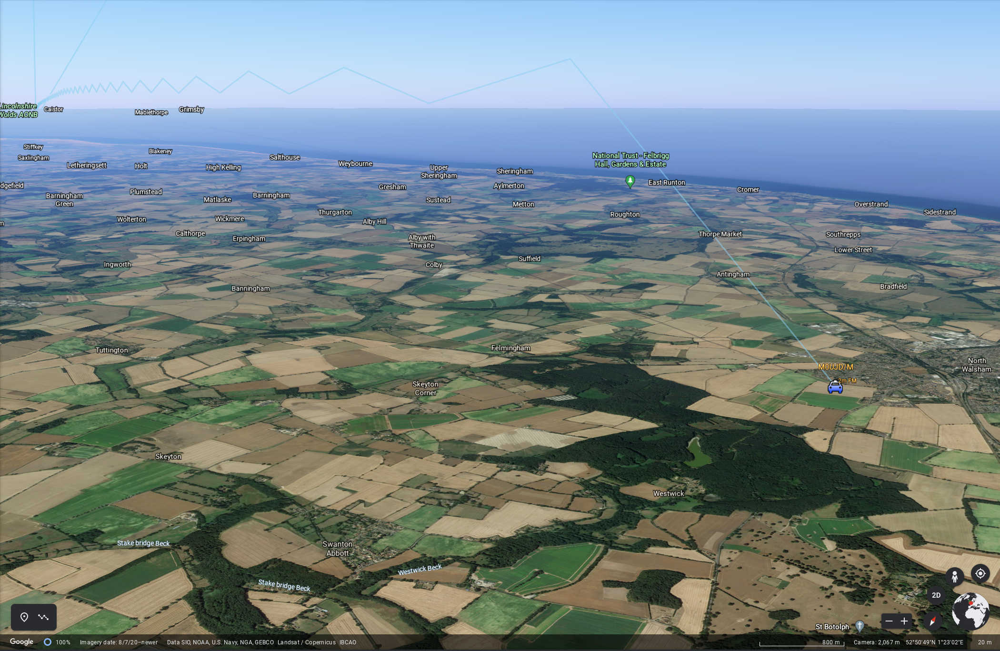
_Example of Tropospheric Ducting Visualization_

***
## Background

The ADIF Processor started as a project to allow me to add additional information in the comment field of a [Fast Log Entry](https://df3cb.com/fle/) input file. This means I can specify things like operator name, rig,  activity reference, that couldn't be populated directly from [Fast Log Entry](https://df3cb.com/fle/).

As I like to record the contacted station location as accurately as possible I then decided to add
support for up-to 10 character [Maidenhead Locator](https://www.dxzone.com/grid-square-locator-system-explained/) references and at that point stumbled across the idea of visualizing QSOs using Google Earth. There isn't much support for 10 character Maidenhead locators in the mapping tools currently available. The [aprs.fi](http://aprs.fi/) site allows 10 character Maidenhead locators to be entered. When out in the field I use the [HamGPS](https://apkpure.com/hamgps/ea4eoz.HamGPS) android application to determine my 10 character Maidenhead locator.

***
## Source Code

ADIF Processor is written in Java as a Spring Boot Application. It makes use of the following separate GitHub projects.

### ADIF Library
A [fork](https://github.com/urbancamo/adif) of the [ADIF library](https://github.com/MarSik/adif) by Martin Sivák. I have made some corrections and enhancements to the original library.

### The adif-processor

The [adif-processor](https://github.com/urbancamo/adif-processor) contains the main functionality of ADIF Processor. 

All the code to generate the enhanced ADIF file, interact with QRZ.COM, load the activity databases, generate the KML file and generate the Markdown file is contained in this project. 

The adif-processor contains a standalone, command-line based main application file, so it can be used directly from the command line without a web interface. 

There is a comprehensive set of command line options. See the [project README.md](https://github.com/urbancamo/adif-processor/blob/main/README.md) for more information.
 
### The ADIF Web Front end

The [adifweb](https://github.com/urbancamo/adifweb) project contains the web-based interface to the adif-processor. The version you are using is a spring-boot web application that is hosted as an AWS Elastic Beanstalk project.

***
## Future Directions

- Improve the propagation model
- Save and Load Preferences
- Customizable Markdown table fields

***
# Examples

## Google Earth KML Project Images

Here are some example Google Earth images from an [evening activation](https://reflector.sota.org.uk/t/sunset-and-dx-in-the-lake-district-does-it-get-any-better-than-this/26261) of SOTA Summit [Gummer's How G/LD-050](https://sotl.as/map/coordinates/54.312226,-2.989878/10.0#/summits/G/LD-050).

<a href="https://urbancamo.github.io/images/image2.jpg">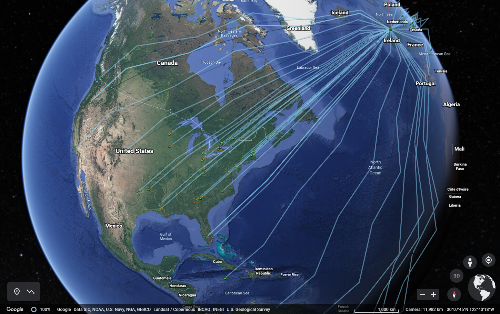

<a href="https://urbancamo.github.io/images/image0.jpg">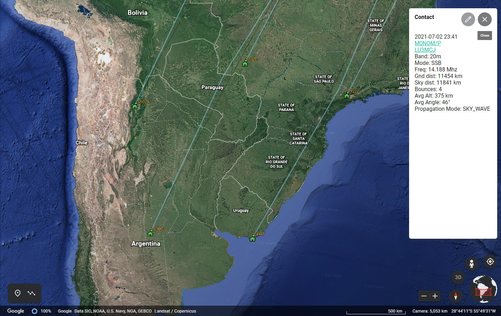

<a href="https://urbancamo.github.io/images/image1.jpg">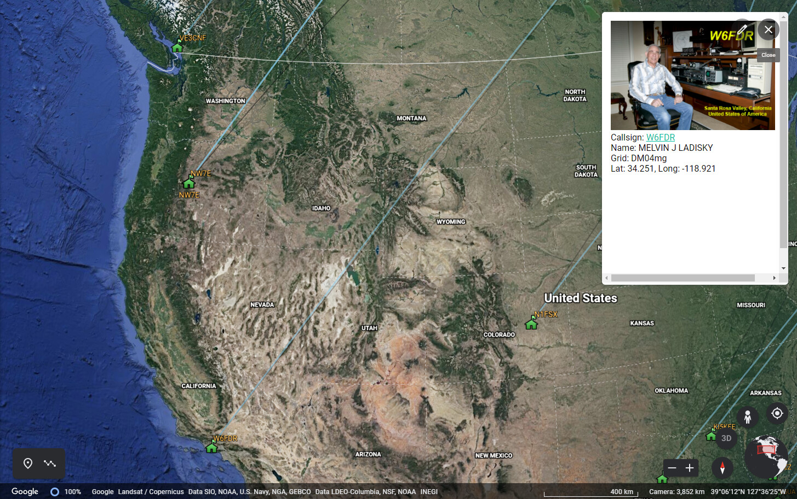

<a href="https://urbancamo.github.io/images/image3.jpg">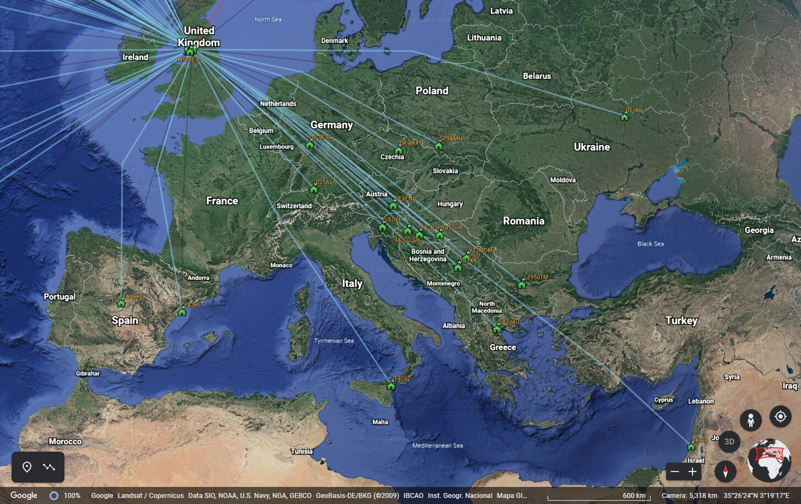

<a href="https://urbancamo.github.io/images/image4.jpg">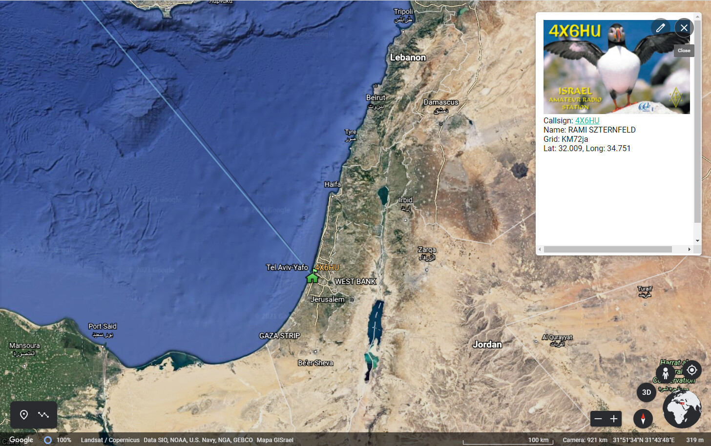

<a href="https://urbancamo.github.io/images/image5.jpg">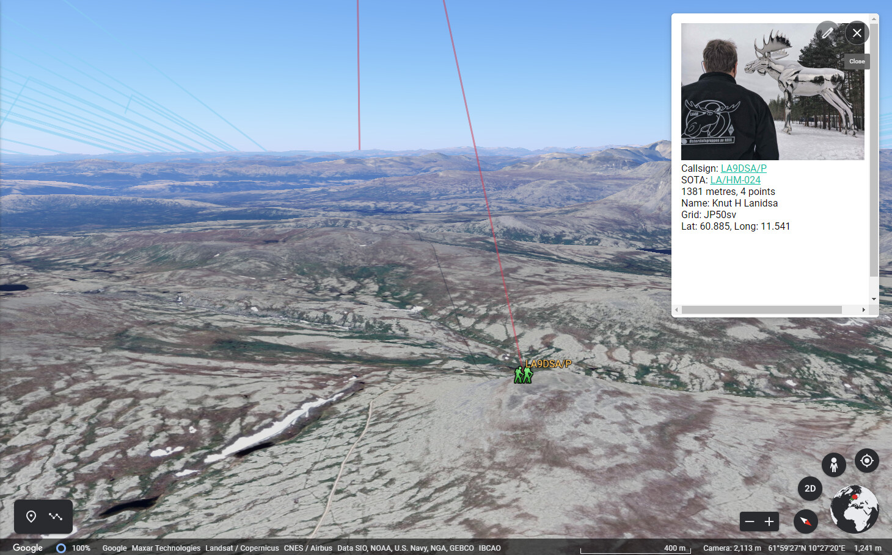

## Example Markdown Contacts List

|DATE      |TIME |CALLSIGN    |    FREQ| BAND|MODE|RST|RSR|SOTA-TX  |SOTA-RX  |OPERATOR  |SIG  |REF     |COMMENT                      |MHL   |
|----------|-----|------------|--------|-----|----|---|---|---------|---------|----------|-----|--------|-----------------------------|------|
|2021.08.01|09:30|G6AEK/M     | 145.450|   2m|  FM| 59| 59|G/LD-050 |         |Molyneux  |     |        |                             |IO83lw|
|2021.08.01|09:32|2W1PJE/P    | 145.450|   2m|  FM| 58| 59|G/LD-050 |GW/NW-015|Peter     |SOTA |GW/NW-01|SOTA: GW/NW-015              |IO82DS|
|2021.08.01|09:37|M0YCJ/P     | 145.400|   2m|  FM| 55| 57|G/LD-050 |G/NP-010 |Colwny    |SOTA |G/NP-010|SOTA: G/NP-010               |IO84VD|
|2021.08.01|09:57|G0UOK/P     | 145.400|   2m|  FM| 59| 59|G/LD-050 |G/NP-004 |Dutton    |SOTA |G/NP-004|SOTA: G/NP-004               |IO84TF|
|2021.08.01|09:58|M7SHZ/P     | 145.400|   2m|  FM| 59| 59|G/LD-050 |G/NP-004 |Sharon    |SOTA |G/NP-004|SOTA: G/NP-004               |IO84TF|
|2021.08.01|09:59|G5ZX/P      | 145.400|   2m|  FM| 59| 59|G/LD-050 |G/NP-004 |Steve     |SOTA |G/NP-004|SOTA: G/NP-004               |IO84TF|
|2021.08.01|10:16|MW7DTE/P    | 145.475|   2m|  FM| 59| 59|G/LD-050 |GW/NW-006|Evans     |SOTA |GW/NW-00|SOTA: GW/NW-006              |IO83AC|
|2021.08.01|10:20|G4OBK/P     |   7.118|  40m| SSB| 59| 59|G/LD-050 |G/NP-009 |Catterall |SOTA |G/NP-009|SOTA: G/NP-009               |IO84XE|
|2021.08.01|10:35|CT2HOV/P    |  14.290|  20m| SSB| 57| 57|G/LD-050 |CT/BA-010|Pereira Go|SOTA |CT/BA-01|SOTA: CT/BA-010              |IN51WA|
|2021.08.01|10:37|G6PJZ/P     | 145.525|   2m|  FM| 55| 43|G/LD-050 |G/TW-003 |Clift     |SOTA |G/TW-003|SOTA: G/TW-003               |IO94LM|
|2021.08.01|10:45|SP9MA/P     |  10.114|  30m|  CW|559|599|G/LD-050 |SP/SS-012|Jarek     |SOTA |SP/SS-01|SOTA: SP/SS-012              |JO80BT|
|2021.08.01|10:56|G8TMV/P     |   5.398|  60m| SSB| 59| 59|G/LD-050 |G/WB-015 |TUCKLEY   |SOTA |G/WB-015|SOTA: G/WB-015               |IO82OL|
|2021.08.01|11:04|F4HPV/P     |  14.280|  20m| SSB| 57| 59|G/LD-050 |F/AM-396 |michel    |SOTA |F/AM-396|SOTA: F/AM-396               |JN33HR|
|2021.08.01|11:07|I1WKN/P     |  14.288|  20m| SSB| 57| 59|G/LD-050 |I/PM-148 |SERA      |SOTA |I/PM-148|SOTA: I/PM-148               |JN34NH|
|2021.08.01|11:11|MS0TA/P     |   7.150|  40m| SSB| 57| 59|G/LD-050 |GM/WS-242|Scotland  |SOTA |GM/WS-24|SOTA: GM/WS-242              |IO76NL|
|2021.08.01|11:18|SA3IEI/P    |  14.064|  20m|  CW|559|559|G/LD-050 |SM/JL-057|Beaton    |SOTA |SM/JL-05|SOTA: SM/JL-057              |JP63PD|
|2021.08.01|11:25|HB9LEK/P    |  14.286|  20m| SSB| 55| 55|G/LD-050 |HB/ZH-015|Neukomm   |SOTA |HB/ZH-01|SOTA: HB/ZH-015              |JN47FK|
|2021.08.01|11:29|IU0FBK/P    |  14.220|  20m| SSB| 58| 57|G/LD-050 |         |Marco     |     |        |                             |JN61fv|
|2021.08.01|11:40|G3TQQ/P     |  14.310|  20m| SSB| 59| 59|G/LD-050 |G/TW-002 |BOTTOMLEY |SOTA |G/TW-002|SOTA: G/TW-002               |IO94JK|
|2021.08.01|11:46|G5ZX/P      |  14.310|  20m| SSB| 59| 59|G/LD-050 |G/NP-004 |W         |SOTA |G/NP-004|SOTA: G/NP-004               |IO84TF|
|2021.08.01|11:48|YO8AZQ/P    |  14.310|  20m| SSB| 52| 55|G/LD-050 |YO/EC-227|DONE      |SOTA |YO/EC-22|SOTA: YO/EC-227              |KN27QJ|
|2021.08.01|11:53|DD2ZN/P     |  14.280|  20m| SSB| 59| 58|G/LD-050 |DM/HE-059|Pralle    |SOTA |DM/HE-05|SOTA: DM/HE-059              |JO40DD|
|2021.08.01|12:12|2W1PJE/P    | 145.375|   2m|  FM| 59| 59|G/LD-050 |GW/NW-007|Peter     |SOTA |GW/NW-00|SOTA: GW/NW-007              |IO82DS|
|2021.08.01|12:16|EA2CCG/P    |  14.310|  20m| SSB| 52| 53|G/LD-050 |EA2/NV-14|Montoya Ji|SOTA |EA2/NV-1|SOTA: EA2/NV-148             |IN92AP|
|2021.08.01|12:19|YO5OTA/P    |  14.283|  20m| SSB| 55| 52|G/LD-050 |YO/WC-225|Pascal    |SOTA |YO/WC-22|SOTA: YO/WC-225              |KN16QN|
|2021.08.01|12:41|GW7LAS/P    |   3.776|  80m| SSB| 59| 59|G/LD-050 |         |Rob       |HEMA |GW/HMW-0|HEMA: GW/HMW-043             |IO82JD|

