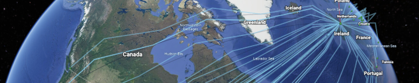
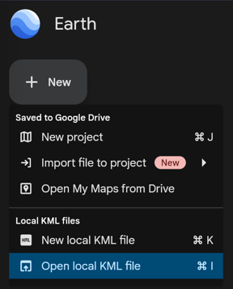
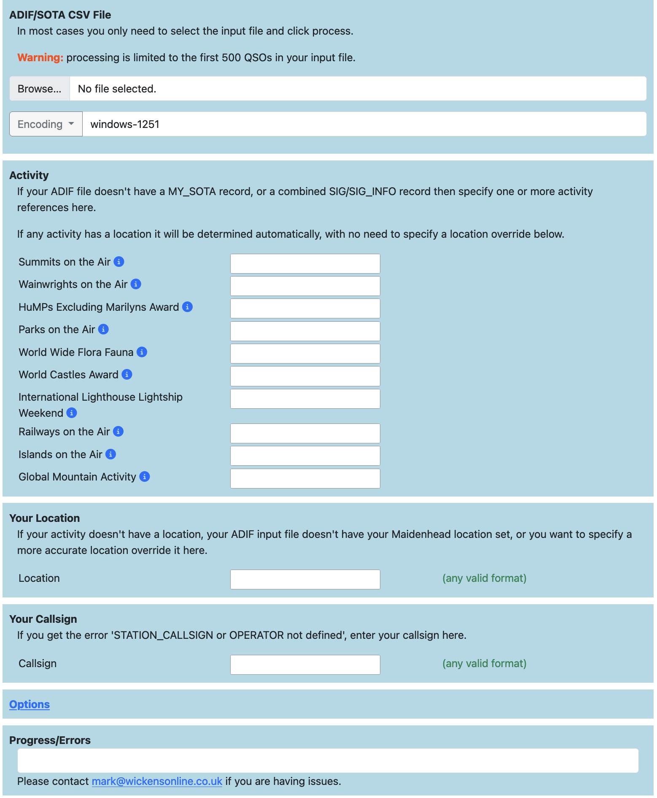
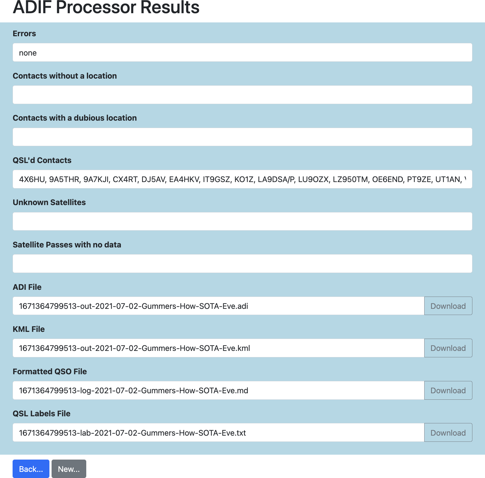
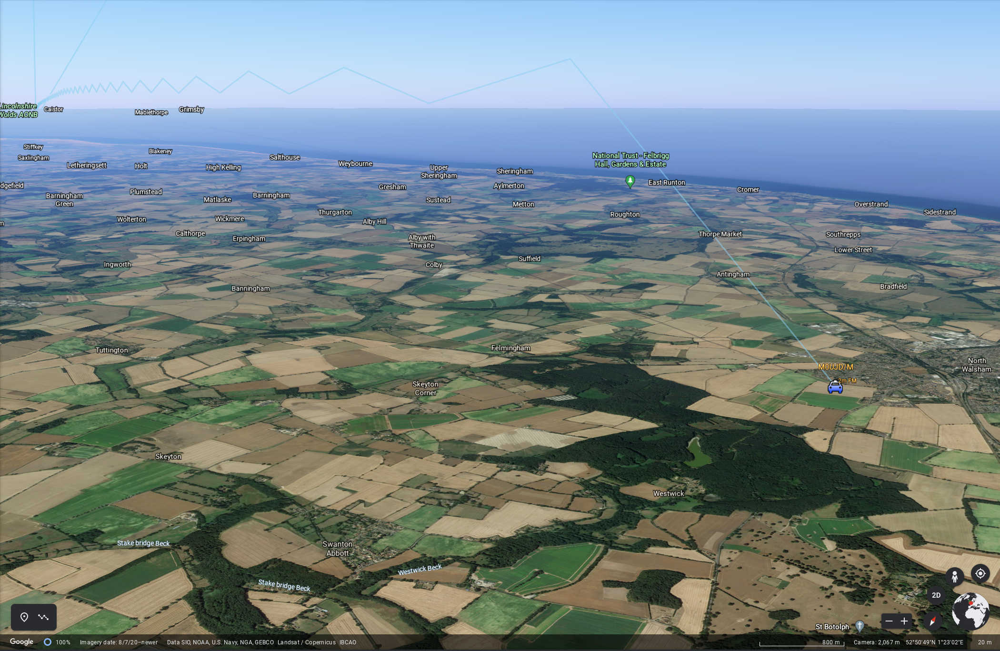

# [ADIF Processor](http://adifweb-env.eba-saseumwd.eu-west-2.elasticbeanstalk.com/)	


Available through the shorter link: [https://bit.ly/adifproc](https://bit.ly/adifproc). 
Please consider joining the [adifproc groups.io group](https://groups.io/g/adifproc) for 
update announcements, bug reports etc.

## Introduction

The [ADIF Processor](http://adifweb-env.eba-saseumwd.eu-west-2.elasticbeanstalk.com/) is an online application
that visualizes amateur radio contacts from an ADIF log file using [Google Earth](https://earth.google.com).
[SOTA](https://www.sotadata.org.uk/en/) CSV log files can also be used.

As well as allowing you to view and explore your contacts in Google Earth, you will be able to:
- see a [Markdown](https://www.markdownguide.org/) or text table of contacts.
- use the output ADIF file which contains QRZ.com data, accurate contact distances and fields populated from comments
  in the input file.
- print [QSL labels](./qsl-labels/qsl-labels.md).

One of the benefits of using the ADIF Processor before uploading/storing your ADIF file 
is detecting errors in callsigns and activity references (e.g. POTA or SOTA references).

A high-level overview of the process is shown below:

```
            ┌─────────────┐
            │ ADIF or CSV │
            └─────────────┘
                   ↓
 ┌───────────────────────────────────┐   ┌────────┐
 │               ADIF                │ ← │ Form   │
 │             Processor             │   │ Options│
 └───────────────────────────────────┘   └────────┘
    ↓         ↓         ↓         ↓
┌──────┐  ┌──────┐  ┌──────┐  ┌──────┐
│ ADIF │  │ KML  │  │  MD  │  │ TXT  │
└──────┘  └──────┘  └──────┘  └──────┘
Augmented  Google   Markdown  QSL Labels
  ADIF     Earth     Table   for Printing
```

The processor also produces a [Markdown](https://www.markdownguide.org/) format contact table 
(for pasting into a reflector) and can [generate labels for QSL cards](./qsl-labels/qsl-labels.md).

To see your QSOs on the desktop browser based [Google Earth](https://earth.google.com) use
_Import KML file from computer_ via the map pin icon. In Android Google Earth simply click on the downloaded ADIF file.

In a lot of cases you simply select your ADIF file and process it, no other options are required.


_Desktop/Browser Google Earth Project Menu_

I recommended following the Quick Start section below to get a feel for the tool, then have a look at 
the advanced options based on your requirements.

## Quick Start

Select your ADIF or SOTA CSV file on the 
[ADIF Processor upload form](http://adifweb-env.eba-saseumwd.eu-west-2.elasticbeanstalk.com/upload) 
and click `Process...` 

<a href="./images/adif-processor-upload-form.png">
_[Simple Use Case](images/upload-form.png)_

You will be presented with four files to download, as required:
- a [Google Earth](https://earth.google.com) Project (KML) file.
- an enhanced ADIF file
- a contact list in either [Markdown](https://www.markdownguide.org/) or plain text format
- a [QSL label file](./qsl-labels/qsl-labels.md)

Any processing errors are displayed in the `Errors` text box. 
Any callsigns for which a location could not be determined are shown in the `Callsigns without Location` text box.

<a href="./images/results.png">
_[Example Result Form](images/results.png)_

If the ADIF Processor cannot determine your location then you specify it using any common location 
format in the _Location_ text field.

__TIP__:
An easy way to find your location is to right-click on [Google Maps](https://maps.google.com) and select 
the Latitude & Longitude value which will copy the value onto the clipboard. 
This can then be pasted directly into the `Location` text box.

**What is an activity?** - any of the supported contests/challenges listed on the ADIF Processor form, 
such as Summits on the Air for example.

If you're logging one of the supported activities you should enter the activity reference. 
Your location will be determined from the activity if possible.

## More Infomation about ADIF Processor

Virtually all Ham Radio Logging programs have the ability to produce ADIF files. ADIF stands for
_Amateur Radio Interchange Format_ and was designed to allow logging applications to export and import
contacts without loosing any information. As such it supports a large number of fields designed to capture
every aspect of a QSO.

You may have connected your logging application to [QRZ.COM](https://qrz.com). If you have an XML Subscription
membership contact details can be automatically pulled from QRZ.COM.

However, if you use a standalone program such as [Fast Log Entry](https://df3cb.com/fle/) then 
the data that you enter as part of the QSO log will be the total information available in the ADIF export.

The ADIF Processor will to add information from QRZ.com. Activity references pull are used to locate portable
operators and add information about the activity. 

Using specially-formatted information in the `COMMENT` field you can populate the correct fields in the output
ADIF file.

This works really well for [Fast Log Entry](https://df3cb.com/fle/) with only limited support
for ADIF fields built into the application. 

***

## How the ADIF Processor Works

There are a number of steps the ADIF Processor performs as it turns your ADIF file into a Google Earth 
KML project file. Key is identifying a location for each end of a contact.

### Determining Your Station Location

Lots here depends on whether you are operating from a fixed location or portable. 

If you are fixed the simplest solution is to ensure your QRZ.COM entry has a latitude & longitude for the most 
accurate location. 

If you aren't a fan of QRZ.COM you can override your location on the form either by specifying a latitude or 
longitude, or alternatively a Maidenhead Locator. 

If you want to obscure your location then specify a 6 or 8 character locator rather than the most 
accurate 10 character version.

If your location isn't fixed (/P, /M, /A) use one of the following to let the ADIF processor know where to place
you: 

* ADIF input file contains a `MY_SOTA_REF`, `MY_POTA_REF`, `MY_WWFF_REF`
* A supported activity and reference in the `MY_SIG_INFO` & `MY_SIG_REF` fields, where that activity has a location
* Specify `MY_GRIDSQUARE` or `LATITUDE` & `LONGITUDE`.

If none of these are an option for you then let the processor know where you are via the form, 
either by specifying an activity reference, or directly entering your location. 

The _Location_ field on the form
supports any of the coordinate formats you can use in the
[Coordinate Converter](http://adifweb-env.eba-saseumwd.eu-west-2.elasticbeanstalk.com/coord), for example:

 * Latitude and Longitude, eg: 54.3709 -2.9099 or 54° 22.260' N, 3° 5.403' W
 * Maidenhead Locator (4/6/8/10 character), eg: IO84NI
 * Activity Reference in the SOTA/WOTA/LOTA/POTA/ROTA/COTA/WWFF programmes eg: G/LD-050
 * An OSGB36 British National Grid Reference, 4 or 5 digit, eg: SD 40891 97674
 * An OSGB36 British National Grid Easting/Northing, eg: E 332222, N 527763
 * A street address for geocoding

### Determining Other Station Locations

For each of your hard earned contacts ADIF Processor attempts to determine a location. 
It does this using a number of techniques, in order of accuracy:

1. A `LATITUDE` and `LONGITUDE` in the ADIF file.
2. Their Activity location (in the `SIG` and `SIG_INFO` or `SOTA_REF` fields of the ADIF input file).
3. Location in QRZ.com, preferring Latitude & Longitude if set over Maidenhead locator.
4. A maidenhead locator in the ADIF file `GRIDSQUARE`.
5. A Geocoding lookup is made via [Nominatim](https://nominatim.org/) and the OpenStreetMap database using any QRZ.com address data.

Note that a number of locations are regarded as _dubious_ or _invalid_ based on them being the default grid or 
latitude/longitude location in QRZ.com. In these cases unless an override location is specified in the
input ADIF file a Geocoding lookup is made to determine the station location.

### Stations without a location

Where no location can be determined a warning is issued, and the station isn't added to the Google Earth KML file. 
You can correct this by adding an activity for the station, 
or by specifying their `LATITUDE` and `LONGITUDE` in the ADIF input file or their `GRIDSQUARE` reference.

### Adding Station Information from QRZ.COM

In order to enrich the ADIF output file, and provide more information when you click on a station icon 
in Google Earth, a lookup is made for additional station information from [QRZ.COM](https://qrz.com). 

The initial lookup is for the callsign as logged, but for some callsigns more work is required to 
determine the information.

The worst case is a portable operator abroad. It is unlikely the operator has created a specific QRZ.COM 
page for this callsign. I'll use examples to show how the application tries to determine the most accurate
information.

When operating on holiday in Spain I used the callsign `EA7/M0NOM/P`. If you had a contact with me and
used the ADIF Processor it would check QRZ.COM for the following callsign variants in order:

- `EA7/M0NOM/P`
- `EA7/M0NOM`
- `M0NOM/P`
- `M0NOM`

The UK complicates this a little more, as a Scottish operator `MM0XRT` activating a HEMA summit in Wales
would be `MW0XRT/P`. In this case QRZ.COM would be queried with UK country callsign variants:

- `MW0XRT/P`
- `MW0XRT`
- `M0XRT/P`
- `M0XRT`
- `MM0XRT/P`
- `MM0XRT`
- `MI0XRT/P`
- `MI0XRT`
- `MD0XRT/P`
- `MD0XRT`
- `MG0XRT/P`
- `MG0XRT`

As soon as a variant matches in QRZ.COM the search stops. I've almost certainly only scratched the surface 
on this process!

### Station Icons in Google Earth

Each station in the Google Earth project file has an icon. The icon used depends on the callsign suffix
or if a station has been recorded doing an activity.

Here are the possible icons:

| Icon                           | Suffix     | Activity | Description/Link                                                     |
|--------------------------------|------------|----------|----------------------------------------------------------------------|
|  | none or /A |          | At home or alternate address                                         |
|           | /P         |          | Portable                                                             |
|         | /MM        |          | Maritime Mobile                                                      |
|        | /AM        |          | Aeronautical Mobile                                                  |
|            | /M         |          | Mobile                                                               |
|       | /P         | SOTA     | [Summits on the Air](https://www.sota.org.uk/)                       |
|       | /P         | GMA      | [Global Mountain Activity](https://www.cqgma.org/)                   |
|       | /P         | HEMA     | [HuMPs Excluding Marilyns Award](http://hema.org.uk/)                |
|          | /P         | POTA     | [Parks on the Air](https://parksontheair.com/)                       |
|         | /P         | COTA     | [World Castles Award Programme](http://www.wca.qrz.ru/ENG/main.html) |
|           | /P         | WOTA     | [Wainwrights on the Air](https://www.wota.org.uk/)                   |
|           | /P         | WWFF     | [World Wide Flora & Fauna in Amateur Radio](https://wwff.co/)        |
|          |            | LOTA     | [International Lighthouse & Lightship Weekend](https://illw.net/)    |
|            |            | ROTA     | [Railways on the Air](https://rota.barac.org.uk/)                    |
|            |            | IOTA     | [Islands on the Air](https://www.iota-world.org/)                    |

Stations are selectable on the Google Earth map, or by selecting the station in the project list. 
When you do this a panel of information about the station is displayed. If the operator has a picture 
on QRZ.COM this is displayed together with details of activity the station was participating in and the
frequency and mode of contact.

The communication paths between stations are also selectable directly from the line drawn on the Google 
Earth visualization (noting that a 'shadow' dark gray line is also drawn to help with the visualization) 
or from the project list.

When you select a communication path a panel of information is displayed that contains both station callsigns, 
together with the date and time of the contact and the propagation mode. For `SKYWAVE` contacts the number 
of reflections is displayed together with the bounce height, length of contact across the surface of the earth as 
well as the distance the predicted path of communication took.

## Visualizing a QSO

ADIF Processor uses a simple propagation visualization technique based on an ideal antenna. For HF signals 
this gives an idea of the minimum number of hops your QSO would have needed to reach the target station.

### The Propagation Model

This is a very simple model designed to map both HF and VHF/UHF contacts.

It supports predicting `SKYWAVE`, `GROUNDWAVE` and `SPORADIC_E` propagation modes. You can specify
`TROPOSPHERIC_DUCTING` for contacts identified as using this propagation.

If you use `INTERNET` as the propagation mode comms lines are drawn across the Earth directly between
stations.

Where the distance between two stations using HF is short it is assumed that the communication 
path is `GROUNDWAVE`.

This is the logic applied in determining the propagation mode. Note that there can be considerable 
improvements made to this model, but any model is only ever going to be a 'best guess'.

| Frequency            | Distance  | Classification |
|----------------------|-----------|----------------|
| 𝑓 > 50 MHz          | < 400 km  | `GROUNDWAVE`   |
| 𝑓 > 50 MHz          | > 400 km  | `SPORADIC-E`   |
| 7 MHz > 𝑓 > 50 MHz  | < 400 km  | `GROUNDWAVE`   |
| 𝑓 < 7 MHz           | >= 400 km | `SKYWAVE`      |


This is a very, very rough approximation. A future enhancement will make the model configurable, and 
ideally would be able to take into account propagation measurements and conditions at the time of the 
contact to help improve the accuracy of the visualization.

### VHF Contacts 
For Groundwave VHF+ contacts the model applies an algorithm to determine a nominal 'bounce height' 
which is a very crude approximation of the curved signal paths that take place in reality. The algorithm 
defines the bounce height as 6 x the distance between two contacts in km, and if possible takes into 
account the height of the stations if that is available from any activities taking place. In general 
this ensures that the visualization of the signal path between two stations using `GROUNDWAVE` is 
visible above the earth that runs underneath the path. This isn't always the case where a contact 
is made from a high to low point or where there is terrain in-between.

### Tropospheric Ducting

In order to visualize a contact that has been via
[tropospheric ducting](https://www.amateur-radio-wiki.net/tropospheric-ducting/)
you must set the `PROPAGATION_MODE` to `TR` in the ADIF input file for that contact.
If you are using Fast Log Entry to create your ADIF file add the comment `PROP_MODE: TR`.

The model used is a duct at height 2,000m and a duct width of 500m, so the signal bounces in a
duct between 2,250m and 1,750m. These value represent an 'average' duct height and width.

### HF Contacts

HF contacts are modelled using a reflection angle that is frequency dependent.
In the _Options_ pane you can choose from a number of different antenna models, with different angles 
of radiation.

| Antenna    | Radiation Angle |
|------------|-----------------|
| Vertical   | 15°             |
| YAGI       | 10°             |
| Dipole     | 20°             |
| Inverted-V | 25°             |

This is a very crude approximation of the reality. It affects the number of calculated reflections, with many
more reflections for example when using an Inverted-V compared to an HF YAGI.

### Long Path HF Contacts

If you want to visualize long path contacts specify either the `ANTPATH` ADIF parameter as `L` in the 
ADIF input file, or specify `PATH: L` in the `COMMENT` field of the ADIF input file.

Long path contacts are visualized using a path that is 180 degrees reversed from the shortest path azimuth. 
The antenna direction specified in the ADIF input file isn't currently used during modelling.


***
## Activities

The ADIF Processor knows about _activities_. The term _Activity_ is used to describe a special activity
that you or the contacted station are participating in. For example: Summits on the Air or Parks on the Air. 
For each activity the ADIF Processor loads the database of activity references. The totals are currently:

- 166,398 Summits on the Air
- 40,115 Parks on the Air
- 51,138 World Wide Flora & Fauna
- 1,178 Islands on the Air
- 3,329 Humps on the Air
- 330 Wainwrights on the Air
- 29,727 Global Mountain Activity
- 65,912 Castles on the Air
- 1,706 Lighthouses on the Air
- 37 Railways on the Air

Specific activity notes:

### Summits on the Air

Summits on the Air references can be used to accurately define the operator's location, as the programme requires them
to be within 25m vertical of the actual summit. If you want to be more accurate you can override the location.

### Parks on the Air

The ADIF format 3.1.4 allows for multiple Parks on the Air references to be specified, as the operator may have 
multiple park references. For example. Whitbarrow Scar in the Lake District is both its' own POTA reference
[G-0190 Whitbarrow National Nature Reserve](https://pota.app/#/park/G-0190) and is also contained in 
[G-0165 Lake District National Park](https://pota.app/#/park/G-0165), so both parks are activated at the same time.
Where there are multiple activity references the first reference is used as the operator location, 
so if you are listing more than one park use the most accurate reference first, or specify the operators' location.

As another example if you are activating [G-0165 Lake District National Park](https://pota.app/#/park/G-0165) you should
override the location of the operator as the location specified for the POTA reference is a 
central marker for the entire national park.

### WWFF

World-wide Flora Fauna locations may or may not have a location specified, therefore it is generally best to 
override the location of the operator.

### Islands on the Air

Locations are approximate, depending on the size of the island, so a location should be specified for the operator.

### Humps on the Air

Locations are summit references and are accurate, so the HEMA reference is normally good enough.

### Wainwrights on the Air

Locations are summit references and are accurate, so the WOTA reference is normally good enough.

### Global Mountain Activity

Locations are summit references and are accurate, so the GMA reference is normally good enough.

### Castles on the Air

Locations are the location of the castle and are generate accurate, so normally good enough.

### Lighthouses on the Air

Locations are the location of the lighthouse or lightship, so normally good enough.

### Railways on the Air

I update the location of the railways on the air references every year, so they are generally good enough.


***

## [Satellite Support](satellite/satellite)

Satellite Support is documented on a [separate page](satellite/satellite).

***

## The ADIF format 30 second Primer

[ADIF](http://adif.org/) _Amateur Data Interchange Format_ is a text file representation for Amateur 
radio contacts. It is a popular output format for logging programs. 
The [ADIF specification](https://adif.org/312/ADIF_312.htm) describes the valid content of the header 
and record fields.

An ADIF file consists of two sections:

- header
- records

### Fields in an ADIF file
Each field in the file is proceeded by a field name separated by the length of the field value with a colon.
For example: `<PROGRAMID:3>FLE` indicates the field is `PROGRAMID` and the text contained in the field
is `3` characters long with a value of `FLE`.

### Header
The header contains information about the program that generate the file and the ADIF version, for example:

```
ADIF Export for Fast Log Entry by DF3CB
<PROGRAMID:3>FLE
<ADIF_VER:5>3.1.0
<EOH>
```

The header is terminated with the `<EOH>` marker.

### Records

Each record captures all the details of a QSO for both the recording station and the contacted station.
A record is terminated by the `<EOF>` marker.

Here is an example entry in a [Fast Log Entry](https://df3cb.com/fle/) input file:

```
40m ssb 7.090
1258 g7las/p 7.188 <OP: Rob, PWR: 50, GRID: IO81LC, HEMA: G/HWB-026>
```

This is the ADIF record generated by [Fast Log Entry](https://df3cb.com/fle/). These
are typically stored on one line. In this case I've separated
each field of a record into a single line:

```
<STATION_CALLSIGN:7>M0NOM/P 
<CALL:7>G7LAS/P 
<QSO_DATE:8>20210522 
<TIME_ON:4>1258 
<BAND:3>40m 
<MODE:3>SSB 
<FREQ:5>7.188 
<RST_SENT:2>59 
<RST_RCVD:2>59 
<COMMENT:47>OP: Rob, PWR: 50, GRID: IO81LC, HEMA: G/HWB-026 
<QSLMSG:44>Thx for QSO from Winter Hill io83ro G/SP-010 
<MY_SOTA_REF:8>G/SP-010 
<OPERATOR:5>M0NOM 
<MY_GRIDSQUARE:6>IO83ro 
<EOR>
```

Note that the QSO has a `<STATION_CALLSIGN:7>` (me) and a `<CALL:7>` G7LAS/P who is on the other end, 
a date and time, frequency, band, mode, signal reports,
my SOTA reference `<MY_SOTA_REF:8>`, the operator (basically my callsign without any modifiers) and my
Maidenhead Locator in `<MY_GRIDSQUARE:6>`.

Of interest is the comment line, which we will examine further, as this is one of the key features 
of post-processing.
In the comment line:

`<COMMENT:49>NAME: Rob, PWR: 50, GRID: IO81LC, HEMA: G/HWB-026
`

You will notice that it consists of a number comma-separated key-value pairs. For example, the first
pair key is `NAME` with value `Rob`, then `PWR` value `50` etc.

***
## The Comment Field in your ADIF file

The ADIF Processor looks carefully for keyword/value pairs in the comment field in your ADIF input file. 
The keyword should be followed by a colon, and a comma may optionally separate each key/value pair. If the 
ADIF Processor recognises a keyword then it acts on the key/value pair to add additional information
to the ADIF output file in the correct ADIF field. 

For example a comment like: `HEMA: G/HLD-001, NAME: Mark, RIG: FT-817, PWR: 5`
would be processed one key/value pair at time and would result in the following ADIF fields being set:

| ADIF Field | Value     |
|------------|-----------|
| SIG        | HEMA      |
| SIG_INFO   | G/HLD-001 |
| NAME       | Mark      |
| RIG        | FT-817    |
| RX_PWR     | 5         |

## Supported Comment Name/Value pairs

The ADIF Processor supports all ADIF field names, as defined in the [ADIF Specification](http://adif.org.uk/).
See the [ADIF Fields & Types](./adif-fields-and-types.md) page for a complete list.

In addition to the standard field names, a number of shortcuts are supported, as specified in the table below.

In the table below the `Comment Key` column shows the keyword you should specify if you want to add 
additional information in the ADIF output file. See the `Sample Value` column for an example of the 
data to be provided. Activity references must use the correct syntax. The `Target ADIF Field` column 
show where the data will be located in the ADIF output file.

In each case (unless noted) these values refer to the contact station information.

For activity references specifying a reference that has an associated location will also set their 
`LAT` & `LONG` value for the location associated with the activity reference (unless that location 
has been overriden explicitly).

| Description                 | Comment Key | Sample  Value(s)      | Target ADIF Field        |
|-----------------------------|-------------|-----------------------|--------------------------|
| Coordinate†                 | `COORD`     | 50°50'56"N 14°38'49"E | `LATITUDE` & `LONGITUDE` |
| Islands on the Air Ref.     | `IOTA`      | E-145                 | `IOTA`                   |
| Parks on the Air Ref.       | `POTA`      | G-0190,G-0165         | `POTA_REF`               |
| Summits on the Air Ref.     | `SOTA`      | G/LD-001              | `SOTA_REF`               |
| Castles on the Air          | `COTA`      | DL-03609              | `SIG`/`SIG_INFO`         |
| Humps on the Air Ref.       | `HEMA`      | G/HLD-001             | `SIG`/`SIG_INFO`         |
| Wainwrights on the Air Ref. | `WOTA`      | LDW-001               | `SIG`/`SIG_INFO`         |
| Worldwide Flora Fauna Ref.  | `WWFF`      | GFF-0233              | `SIG`/`SIG_INFO`         |
| Lighthouses on the Air Ref. | `LOTA`      | UK0019                | `SIG`/`SIF_INFO`         |
| Railways on the Air Ref.    | `ROTA`      | GB4LHR                | `SIG`/`SIG_INFO`         |

†Coordinate can be specified in most latitude/longitude formats including decimal, degrees 
minute seconds, degrees decimal minutes etc.

When using [Fast Log Entry](https://df3cb.com/fle/), format your comment next to your QSO record 
between angle brackets, for example:

```
2111 g7tcq/m  59 59 <QTH: M6 J11 N. Birmingham, PROP: TR> #IO82xq 
2118 g4iog    55 52 <NAME: Bob RIG: FT-991 PWR: 50w QTH: Sittingborne PROP: TR>
```

Note that each keyword **must** be followed by a colon and each pair **may** be followed by a comma. 
If you are specifying a latitude/longitude pair you can use comma separated values (for example when pasted in
from Google Maps).

To add information to go in the
`COMMENT` field of the ADIF file directly use a key of `COMMENT`, or use a key of `NOTES` to specify 
information to go in the ADIF `NOTES` field.

***
## Propagation Modes

These are the valid values for the propagation modes that the ADIF Processor currently supports 
that can be specified in the ADIF field `PROP_MODE` or via the Fast Log Entry comment key
`PROP`:

| Value      | Mode                 |
|------------|----------------------|
| empty      | Predict              |
| `TR`       | Tropospheric Ducting |
| `ES`       | Sporadic E           |
| `F2`       | F2 Reflection        |
| `INTERNET` | Internet-based       |

If the mode isn't specified then it is predicted. Note that the prediction model doesn't include 
Tropospheric Ducting, you need to specify that manually. The distance achieved by UHF/HVF contacts 
varies enormously based on location, antenna and mode so long-distance point-to-point contacts are 
entirely feasible.

<a href="./images/TroposphericDuctingContactExample.png"></a>
_Example of Tropospheric Ducting Visualization_

***

## Background of the Project

The ADIF Processor started as a project to allow me to add additional information in the comment field of 
a [Fast Log Entry](https://df3cb.com/fle/) input file. This meant I could specify things like operator name,
rig, their power and activity references, that couldn't be populated directly from 
[Fast Log Entry](https://df3cb.com/fle/).

As I like to record the contacted station location as accurately as possible I then decided to add
support for up-to 10 character 
[Maidenhead Locator](https://www.dxzone.com/grid-square-locator-system-explained/) references and 
at that point stumbled across the idea of visualizing QSOs using Google Earth. There isn't much support
for 10 character Maidenhead locators in the mapping tools currently available. 
The [aprs.fi](http://aprs.fi/) site allows 10 character Maidenhead locators to be entered. 
When out in the field I use the [HamGPS](https://apkpure.com/hamgps/ea4eoz.HamGPS) Android 
application to determine my 10 character Maidenhead locator.

***
## Source Code

ADIF Processor is written in Java as a Spring Boot Application. It makes use of the following separate
GitHub projects.

### ADIF Library
A [fork](https://github.com/urbancamo/adif) of the [ADIF library](https://github.com/MarSik/adif) 
by Martin Sivák. I have made some corrections and enhancements to the original library.

### The adif-processor

The [adif-processor](https://github.com/urbancamo/adif-processor) contains the main functionality of 
ADIF Processor. 

All the code to generate the enhanced ADIF file, interact with QRZ.COM, load the activity databases, 
generate the KML file and generate the Markdown file is contained in this project. 

The adif-processor contains a standalone, command-line based main application file, so it can be used 
directly from the command line without a web interface. 

There is a comprehensive set of command line options. See 
the [project README.md](https://github.com/urbancamo/adif-processor/blob/main/README.md) for more information.
 
### The ADIF Web Front end

The [adifweb](https://github.com/urbancamo/adifweb) project contains the web-based interface to 
the adif-processor. The version you are using is a Bootstrap based spring-boot web application 
that is hosted as an AWS Elastic Beanstalk project.

***
# Examples

## Google Earth KML Project Images

Here are some example Google Earth images from an [evening activation](https://reflector.sota.org.uk/t/sunset-and-dx-in-the-lake-district-does-it-get-any-better-than-this/26261) of SOTA Summit [Gummer's How G/LD-050](https://sotl.as/map/coordinates/54.312226,-2.989878/10.0#/summits/G/LD-050).

<a href="./images/sample1.png">

<a href="./images/sample2.png">

<a href="./images/sample3.png">

<a href="./images/sample4.png">

<a href="./images/sample5.png">

<a href="./images/sample6.png">


## Example Markdown Contacts List


| TIME  | CALLSIGN                                | BAND | MODE | RST | RSR | OPERATOR  | SIG  | REF                                                       |
|-------|-----------------------------------------|------|------|-----|-----|-----------|------|-----------------------------------------------------------|
| 19:45 | [EA3KE](https://qrz.com/db/EA3KE)       | 20m  | SSB  | 59  | 59  | Tony      |      |                                                           |
| 20:05 | [9A/G0JDK](https://qrz.com/db/9A/G0JDK) | 20m  | SSB  | 59  | 59  | Alan      |      |                                                           |
| 20:08 | [M5TUE/P](https://qrz.com/db/M5TUE)     | 2m   | FM   | 59  | 59  | Nigel     |      |                                                           |
| 20:24 | [G0HIK](https://qrz.com/db/G0HIK)       | 2m   | FM   | 59  | 58  | Nick      |      |                                                           |
| 20:31 | [9A5THR](https://qrz.com/db/9A5THR)     | 20m  | SSB  | 59  | 59  | Tomy      |      |                                                           |
| 20:39 | [LA9DSA/P](https://qrz.com/db/LA9DSA)   | 40m  | SSB  | 59  | 59  | Knot      | SOTA | [LA/HM-024](https://summits.sota.org.uk/summit/LA/HM-024) |
| 20:46 | [YU1XA](https://qrz.com/db/YU1XA)       | 20m  | SSB  | 59  | 59  | Blagomir  |      |                                                           |
| 20:51 | [EA4HKV](https://qrz.com/db/EA4HKV)     | 20m  | SSB  | 59  | 56  | Jorge     |      |                                                           |
| 20:59 | DG9FBH                                  | 20m  | SSB  | 59  | 59  | Lota      |      |                                                           |
| 21:08 | [LZ950TM](https://qrz.com/db/LZ950TM)   | 20m  | SSB  | 59  | 59  | Bulgarian |      |                                                           |
| 21:10 | [IT9GSZ](https://qrz.com/db/IT9GSZ)     | 20m  | SSB  | 59  | 59  | Nunziato  |      |                                                           |
| 21:22 | [PZ2YT](https://qrz.com/db/PZ2YT)       | 20m  | SSB  | 59  | 56  | Yudel     |      |                                                           |
| 21:29 | [CX4RT](https://qrz.com/db/CX4RT)       | 20m  | SSB  | 59  | 57  | Juan      |      |                                                           |
| 21:50 | [K2J](https://qrz.com/db/K2J)           | 20m  | SSB  | 59  | 59  | 13        |      |                                                           |
| 21:56 | [W3ZW](https://qrz.com/db/W3ZW)         | 20m  | SSB  | 53  | 55  | Wilf      |      |                                                           |
| 21:58 | [YT2MDM](https://qrz.com/db/YT2MDM)     | 20m  | SSB  | 59  | 59  | Vlad      |      |                                                           |
| 22:01 | [DJ5AV](https://qrz.com/db/DJ5AV)       | 20m  | SSB  | 59  | 57  | Michael   |      |                                                           |
| 22:02 | [KA3YIA](https://qrz.com/db/KA3YIA)     | 20m  | SSB  | 57  | 53  | DONALD    |      |                                                           |
| 22:04 | [SV2JAO](https://qrz.com/db/SV2JAO)     | 20m  | SSB  | 59  | 59  | Andreas   |      |                                                           |
| 22:04 | [S57ILF](https://qrz.com/db/S57ILF)     | 20m  | SSB  | 59  | 55  | FRANCI    |      |                                                           |
| 22:07 | [KC1GTK](https://qrz.com/db/KC1GTK)     | 20m  | SSB  | 59  | 59  | Paul      |      |                                                           |
| 22:09 | [K5UA](https://qrz.com/db/K5UA)         | 20m  | SSB  | 57  | 57  | Charles   |      |                                                           |
| 22:10 | OK9MAT                                  | 20m  | SSB  | 57  | 57  |           |      |                                                           |
| 22:12 | [K0DV](https://qrz.com/db/K0DV)         | 20m  | SSB  | 59  | 56  | Doug      |      |                                                           |
| 22:14 | [9A7KJI](https://qrz.com/db/9A7KJI)     | 20m  | SSB  | 59  | 59  | Hinko     |      |                                                           |
| 22:14 | [PY2ZZ](https://qrz.com/db/PY2ZZ)       | 20m  | SSB  | 59  | 59  | MARIO     |      |                                                           |
| 22:15 | [W4LDS](https://qrz.com/db/W4LDS)       | 20m  | SSB  | 59  | 59  | Luis      |      |                                                           |
| 22:16 | [SP9AMH](https://qrz.com/db/SP9AMH)     | 20m  | SSB  | 51  | 57  | Mariusz   |      |                                                           |
| 22:17 | [LU9OZX](https://qrz.com/db/LU9OZX)     | 20m  | SSB  | 59  | 59  | Frank     |      |                                                           |
| 22:18 | [PT9ZE](https://qrz.com/db/PT9ZE)       | 20m  | SSB  | 59  | 59  | Joe       |      |                                                           |
| 22:19 | [WA1AYY](https://qrz.com/db/WA1AYY)     | 20m  | SSB  | 59  | 58  | Dom       |      |                                                           |
| 22:22 | [W8JES](https://qrz.com/db/W8JES)       | 20m  | SSB  | 57  | 55  | John      |      |                                                           |
| 22:26 | [KG5HTH](https://qrz.com/db/KG5HTH)     | 20m  | SSB  | 58  | 52  | PHILIP    |      |                                                           |
| 22:28 | [OE6END](https://qrz.com/db/OE6END)     | 20m  | SSB  | 59  | 53  | Andy      |      |                                                           |
| 22:29 | [KO1Z](https://qrz.com/db/KO1Z)         | 20m  | SSB  | 59  | 55  | Robert    |      |                                                           |
| 22:35 | [6Y5HM](https://qrz.com/db/6Y5HM)       | 20m  | SSB  | 59  | 59  | Hugh      |      |                                                           |
| 22:37 | [VE3NEP](https://qrz.com/db/VE3NEP)     | 20m  | SSB  | 57  | 57  | Frank     |      |                                                           |
| 22:41 | [VE3CNF](https://qrz.com/db/VE3CNF)     | 20m  | SSB  | 59  | 45  | Fred      |      |                                                           |
| 22:42 | [VE3OWV](https://qrz.com/db/VE3OWV)     | 20m  | SSB  | 59  | 57  | Nick      |      |                                                           |
| 22:49 | [W3EMD](https://qrz.com/db/W3EMD)       | 20m  | SSB  | 59  | 58  | Buzz      |      |                                                           |
| 22:52 | [K1CAL](https://qrz.com/db/K1CAL)       | 20m  | SSB  | 59  | 59  | Cal       |      |                                                           |
| 22:54 | [YV5HNJ](https://qrz.com/db/YV5HNJ)     | 20m  | SSB  | 57  | 57  | Ramon     |      |                                                           |
| 22:55 | [K2BQ](https://qrz.com/db/K2BQ)         | 20m  | SSB  | 59  | 59  | Paul      |      |                                                           |
| 22:59 | [VA3EMF](https://qrz.com/db/VA3EMF)     | 20m  | SSB  | 55  | 55  | Peter     |      |                                                           |
| 23:01 | [UT1AN](https://qrz.com/db/UT1AN)       | 20m  | SSB  | 59  | 59  | Alexander |      |                                                           |
| 23:06 | [K2L](https://qrz.com/db/K2L)           | 20m  | SSB  | 59  | 59  | K2L       |      |                                                           |
| 23:30 | [4X6HU](https://qrz.com/db/4X6HU)       | 20m  | SSB  | 58  | 57  | Rami      |      |                                                           |
| 23:34 | [VO1CH](https://qrz.com/db/VO1CH)       | 20m  | SSB  | 59  | 59  | Chris     |      |                                                           |
| 23:41 | [LU3MCJ](https://qrz.com/db/LU3MCJ)     | 20m  | SSB  | 59  | 57  | Emil      |      |                                                           |
| 23:43 | [VA3QAK/P](https://qrz.com/db/VA3QAK/P) | 20m  | SSB  | 59  | 59  | Adrian    |      |                                                           |
| 23:45 | [WB3DSB](https://qrz.com/db/W3EDS)      | 20m  | SSB  | 59  | 58  | Terry     |      |                                                           |
| 23:47 | [KA1KA](https://qrz.com/db/WW1XX)       | 20m  | SSB  | 59  | 58  | Adam      |      |                                                           |
| 23:49 | [KC1OSX](https://qrz.com/db/KC1OSX)     | 20m  | SSB  | 59  | 59  | Steve     |      |                                                           |
| 23:51 | [NW7E](https://qrz.com/db/NW7E)         | 20m  | SSB  | 56  | 53  | Mike      |      |                                                           |
| 23:51 | [KQ4TL](https://qrz.com/db/KQ4TL)       | 20m  | SSB  | 59  | 56  | Ted       |      |                                                           |
| 23:53 | [KI5KEE](https://qrz.com/db/KI5KEE)     | 20m  | SSB  | 59  | 58  | John      |      |                                                           |
| 23:54 | [W5ZZ](https://qrz.com/db/W5ZZ)         | 20m  | SSB  | 59  | 59  | Werg      |      |                                                           |
| 23:57 | [W6FDR](https://qrz.com/db/W6FDR)       | 20m  | SSB  | 59  | 55  | Mel       |      |                                                           |
| 23:57 | [WX8G](https://qrz.com/db/WX8G)         | 20m  | SSB  | 59  | 59  | Gary      |      |                                                           |
| 23:59 | [K2BQ](https://qrz.com/db/K2BQ)         | 20m  | SSB  | 59  | 59  | Paul      |      |                                                           |
| 23:05 | [KU4SD](https://qrz.com/db/KU4SD)       | 20m  | SSB  | 59  | 59  | Garrett   |      |                                                           |
| 23:08 | [NW7E](https://qrz.com/db/NW7E)         | 20m  | SSB  | 57  | 54  | Michael   |      |                                                           |
| 23:10 | [N1FSX](https://qrz.com/db/N1FSX)       | 20m  | SSB  | 57  | 42  | Chris     |      |                                                           |
| 00:13 | [VE9RK](https://qrz.com/db/VE9RK)       | 20m  | SSB  | 59  | 59  | Richard   |      |                                                           |


***
## Release History

| Date        | New Features                                                                                                                                                                                                                   |
|-------------|--------------------------------------------------------------------------------------------------------------------------------------------------------------------------------------------------------------------------------|
| 07-SEP-2021 | Support for Castles on the Air Activity References                                                                                                                                                                             |
| 18-SEP-2021 | Supports Tropospheric Ducting & QO-100 Satellite Contacts                                                                                                                                                                      |
| 23-SEP-2021 | Support for Lighthouses & Railways on the Air                                                                                                                                                                                  |
| 26-SEP-2021 | Initial Geolocation support via Nominatim                                                                                                                                                                                      |
| 15-OCT-2021 | Improved location accuracy reporting, COORD as a comment option                                                                                                                                                                |
| 26-OCT-2021 | Support for Lanzarote HEMA summits                                                                                                                                                                                             |
| 10-NOV-2021 | IOTA incorporated as an activity. Bearings now generated in KML contact info and listing file                                                                                                                                  |
| 05-FEB-2022 | LEO Satellite preliminary support, Long Path HF contact support                                                                                                                                                                |
| 13-FEB-2022 | Support for Global Mountain Activity References                                                                                                                                                                                |
| 16-APR-2022 | Version 1.0.24 - Much improved satellite support and now generates zipped KML files to save space                                                                                                                              |
| 06-MAY-2022 | Version 1.0.31 - Handles Log4OM Lat/Long format in ADIF input file                                                                                                                                                             |
| 07-MAY-2022 | Version 1.0.32 - Support for Irish Grid references in the coordinate converter                                                                                                                                                 |
| 07-MAY-2022 | Version 1.0.33 - Input files with your callsign undefined for some records processed                                                                                                                                           |
| 08-MAY-2022 | Version 1.0.38 - Add support for Aeronautical Mobile including altitude                                                                                                                                                        |
| 10-MAY-2022 | Version 1.0.39 - rewrite altitude support to use an ADIF application defined field                                                                                                                                             |
| 05-JUN-2022 | Version 1.0.45 <br/> - SOTA database refresh as of 14-MAY-2022 <br/> - UK Jubilee secondary locator callsign support <br/> - ADIF coordinate format converter support                                                          |
| 12-JUN-2022 | Version 1.0.48 - Support for ADIF Spec 3.1.3 read/write includes new MY_WWFF_REF/WWFF_REF fields                                                                                                                               |
| 27-AUG-2022 | Version 1.0.59 DXCC entities and better country identification                                                                                                                                                                 |
| 11-OCT-2022 | Version 1.0.61 - Supports visualizing internet propagation modes                                                                                                                                                               |
| 17-DEC-2022 | Version 1.0.71 - QSL label printing support                                                                                                                                                                                    |
| 18-DEC-2022 | Version 1.0.71 - Documentation refresh                                                                                                                                                                                         |
| 22-DEC-2022 | Version 1.0.72 - Support for ADIF Spec 3.1.4 read/write, Specific fields for POTA, Support for Altitude of Station, HamQTH & HamlogEu QSL Upload status/date, Overhaul station activity list to support more than one POTA ref |
| 28-DEC-2022 | Version 1.0.85 - Now using a websocket to provide better feedback of progress. The dreaded 'Gateway timeout' should never happen now. Limit processing to 500 QSOs but you will get a partial process                          |
| 04-JAN-2023 | Version 1.1.0 - Supports all ADIF fields as comment entries, updated POTA list                                                                                                                                                 |
| 25-MAR-2023 | Version 1.1.18 - Checks Name and State against QRZ, updated HEMA summits                                                                                                                                                       |                                                                                                                                                     |

Documentation Version: 2023-03-26
