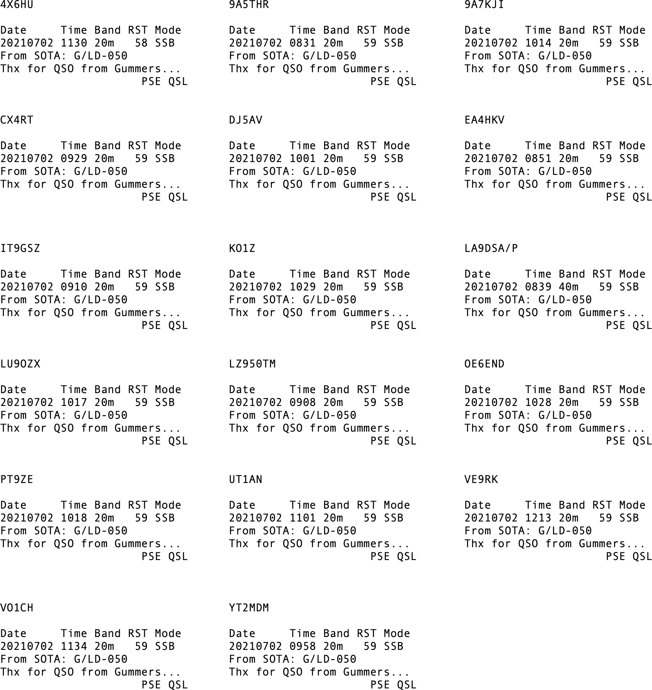
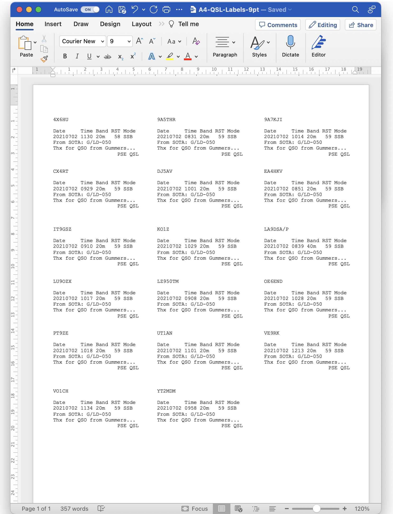

# QSL Labels

## Introduction
The ADIF Processor includes rudimentary support for printing QSL 
card labels. I added this as I found existing logging program support
for printing labels quite difficult to use, and this enables me to 
print labels without needing to import contacts into a logging program.

The process is as follows:
 
 - run the ADIF processor.
 - download the QSL label file.
 - paste the QSL label file into Microsoft Word, or another word processor.
 - print the labels.

I use A4 Avery Labels code is J8159/L7159, the labels are 
63.5mm X 33.9mm and there are 24 labels per sheet.

You can use my [A4 QSL Label Template](../files/A4-QSL-Labels-9pt.docx).
This uses Courier 9 point font.

An example QSL label output file is:



When this is loaded into Word is should look like this:



You can start generation of labels on the sheet at a specified location.
This is useful if you are reusing a partially printed sheet.

If you want to do this specify the position in the Options panel.
Here's a reference of the locations on the label sheet:

```
┌──────┐  ┌──────┐  ┌──────┐
│   1  │  │   2  │  │   3  │  
└──────┘  └──────┘  └──────┘  
┌──────┐  ┌──────┐  ┌──────┐
│   4  │  │   5  │  │   6  │  
└──────┘  └──────┘  └──────┘  
┌──────┐  ┌──────┐  ┌──────┐
│   7  │  │   8  │  │   9  │  
└──────┘  └──────┘  └──────┘  
┌──────┐  ┌──────┐  ┌──────┐
│  10  │  │  11  │  │  12  │  
└──────┘  └──────┘  └──────┘  
┌──────┐  ┌──────┐  ┌──────┐
│  13  │  │  14  │  │  15  │  
└──────┘  └──────┘  └──────┘  
┌──────┐  ┌──────┐  ┌──────┐
│  16  │  │  17  │  │  18  │  
└──────┘  └──────┘  └──────┘  
┌──────┐  ┌──────┐  ┌──────┐
│  19  │  │  20  │  │  21  │  
└──────┘  └──────┘  └──────┘  
┌──────┐  ┌──────┐  ┌──────┐
│  22  │  │  23  │  │  24  │  
└──────┘  └──────┘  └──────┘  
```

This will only affect the first sheet.
### Label Format

The format of each label is as follows:

```
Example:
┌────────────────────────────┐
│4X6HU                       │
│                            │
│Date     Time Band RST Mode │
│20210702 1130 20m   58 SSB  │
│From SOTA: G/LD-050         │
│Thx for QSO from Gummers... │
│                     PSE QSL│
└────────────────────────────┘

Format:
┌────────────────────────────┐
│Callsign                    │
│QSL via...                  │
│Date     Time Band RST Mode │
│yyyymmdd hhmm 20m   58 SSB  │
│Your activity reference     │
│Your QSL Message            │
│                     PSE QSL│
└────────────────────────────┘
```

## Limitations

It's worth noting the limitations:

- I only support 24 labels per sheet with 63.5mm X 33.9mm label dimensions
- This is for bureau contacts. As the processor loads QRZ.com information 
  for each contact it looks at the qsl information and determines if bureau
  is mentioned. If it is a label is generated.
- If you have more than one contact for a station separate labels are generated.
- The format of the label is fixed.

## Why Use a Word Processor rather than print direct?

I decided for the sake of an extra step you then have control over the template used, 
so if things aren't lining up quite right you can modify the word template
document once then use that for subsequent print runs.
