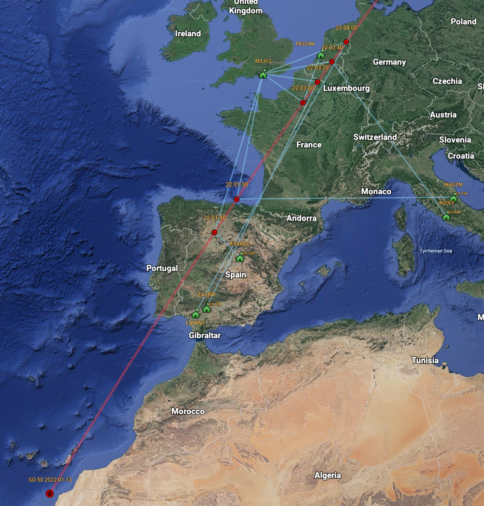

# Satellite Support

## Introduction

QSOs via the [Es’hail 2 / QO-100](https://amsat-uk.org/satellites/geo/eshail-2/) and a number of Low Earth Orbit (LEO)
satellites can be visualized.

If you specify the satellite name or code (see tables below) in the ADIF input file in the field `SAT_NAME` it will be looked up in the supported
list below.

_SO-50 Pass_

### Where you haven't specified the `SAT_NAME` in the input ADIF file

Expand the Options... tab on the ADIF Processor Form and
select the satellite name from the `Satellite Name` dropdown list.

The `Satellite Mode` form field is free text and allows you to specify
the content of the ADIF field `SAT_MODE` - this has no effect on the QSO visualisation.

If you have non-Satellite QSOs in the same ADIF input file they can be visualised normally 
by specifying the up-link band used for the Satellite QSOs in the `Satellite Band` form field.

So for example if you have `13cm` QSOs via `QO-100` and `2m` VHF QSOs locally on a SOTA 
activation then enter `13cm` in the `Satellite Band` form field.

Only QSOS in the input file with band `13cm` will be visualized as satellite contacts.

| Icon                                                                           | Represents        | Label                     |
|--------------------------------------------------------------------------------|-------------------|---------------------------|
|  | Satellite Contact | Time UTC                  |
|                        | Satellite Track   | Satellite Name & Date UTC |

A worked pass of a satellite is show in Google Earth as a red trace. There is a lead to the trace before the first QSO.
Where multiple QSOs are recorded at the same time the times are interpolated based on the order in the input file.

It is recommended that you only visualize one day's activity or a few passes, otherwise the display in Google Earth
gets very cluttered.

## Limitations

The TLE data is accurate on the day the ADIF file is processed. I am working on the ability to use historic TLE data. 
As a result if you try and process a file with contacts from a significant time ago the visualization won't 
be accurate as the TLE data isn't correct for that date.

## Supported Satellites

TLE data is loaded from [amateur.txt hosted on celestrak.com](http://www.celestrak.com/NORAD/elements/amateur.txt).

### Supported Satellites Sorted By Name

Aliases will be added as required based on what folk have in their input files. 
Please let me know if your satellites aren't being rendered but they are supported and I'll
add an alias.

|Name|Code| Aliases |
|----|----|---------|
|2015-049G | |         |
|AAUSAT 4 | |         |
|BEESAT-1 | |         |
|BEESAT-2 | |         |
|BEESAT-3 | |         |
|BEESAT-4 | |         |
|BRICSAT2 |NO-103|         |
|BY70-2 | |         |
|BY70-3 | |         |
|CAS-2T & KS-1Q | |         |
|CAS-6 |TO-108|         |
|CUBEBUG-2 |LO-74|         |
|CUBESAT XI-IV |CO-57|         |
|CUBESAT XI-V | |         |
|CUTE-1.7+APD II |CO-65|         |
|CUTE-1 |CO-55|         |
|DELFI-C3 |DO-64|         |
|DIWATA-2B | |         |
|DIY-1 |ARDUIQUBE|         |
|DUCHIFAT-1 | |         |
|DUCHIFAT-3 | |         |
|ES'HAIL 2 | |         |
|E-ST@R-II | |         |
|EYESAT A |AO-27|         |
|FALCONSAT-3 | |         |
|FOX-1CLIFF |AO-95|         |
|FOX-1D |AO-92|         |
|FUNCUBE-1 |AO-73|         |
|GOMX-1 | |         |
|HUSKYSAT-1 |HO-107|         |
|ISS |ZARYA| ARISS   |
|ITAMSAT |IO-26|         |
|ITASAT 1 | |         |
|ITUPSAT1 | |         |
|JAISAT-1 | |         |
|JAS-2 |FO-29|         |
|JUGNU | |         |
|JY1SAT |JO-97|         |
|KAITUO 1A | |         |
|KAITUO 1B | |         |
|KKS-1 |KISEKI|         |
|LAPAN-A2 | |         |
|LILACSAT-2 | |         |
|LUSAT |LO-19|         |
|MAX VALIER SAT | |         |
|M-CUBED & EXP-1 PRIME | |         |
|MOZHAYETS 4 |RS-22|         |
|NAYIF-1 |EO-88|         |
|NEXUS |FO-99|         |
|NUDT-PHONESAT | |         |
|NUSAT-1 |FRESCO|         |
|ORBITAL FACTORY 2 || |
|OSCAR 7 |AO-7|         |
|PCSAT |NO-44|         |
|PHASE 3B |AO-10|         |
|PSAT2 |NO-104|         |
|QB50P1 | |         |
|RADFXSAT-2 |AO-109|         |
|RADFXSAT |FOX-1B|         |
|RADIO ROSTO |RS-15|         |
|RS-44 & BREEZE-KM R/B | |         |
|SALSAT | |         |
|SAUDISAT 1C |SO-50|         |
|SEEDS II |CO-66|         |
|SOMP | |         |
|SPROUT | |         |
|SRMSAT | |         |
|STRAND-1 | |         |
|SWISSCUBE | |         |
|TECHSAT 1B |GO-32|         |
|TIANWANG 1A |TW-1A|         |
|UNISAT-6 | |         |
|UOSAT 2 |UO-11|         |
|UVSQ-SAT | |         |
|UWE-3 | |         |
|UWE-4 | |         |
|XIWANG-1 |HOPE-1|         |
|XW-2A | |         |
|XW-2B | |         |
|XW-2C | |         |
|XW-2D | |         |
|XW-2E | |         |
|XW-2F | |         |
|XW-3 |CAS-9|         |
|YUBILEINY |RS-30|         |
|ZACUBE-1 |TSHEPISOSAT|         |
|ZDPS 2A | |         |
|ZDPS 2B | |         |
|ZHUHAI-1 01 |CAS-4A|         |
|ZHUHAI-1 02 |CAS-4B|         |

### Supported Satellites Sorted by Code

|Code|Name|
|----|----|
|AO-109|RADFXSAT-2 |
|AO-10|PHASE 3B |
|AO-27|EYESAT A |
|AO-73|FUNCUBE-1 |
|AO-7|OSCAR 7 |
|AO-92|FOX-1D |
|AO-95|FOX-1CLIFF |
|ARDUIQUBE|DIY-1 |
|CAS-4A|ZHUHAI-1 01 |
|CAS-4B|ZHUHAI-1 02 |
|CAS-9|XW-3 |
|CO-55|CUTE-1 |
|CO-57|CUBESAT XI-IV |
|CO-65|CUTE-1.7+APD II |
|CO-66|SEEDS II |
|DO-64|DELFI-C3 |
|EO-88|NAYIF-1 |
|FO-29|JAS-2 |
|FO-99|NEXUS |
|FOX-1B|RADFXSAT |
|FRESCO|NUSAT-1 |
|GO-32|TECHSAT 1B |
|HO-107|HUSKYSAT-1 |
|HOPE-1|XIWANG-1 |
|IO-26|ITAMSAT |
|JO-97|JY1SAT |
|KISEKI|KKS-1 |
|LO-19|LUSAT |
|LO-74|CUBEBUG-2 |
|NO-103|BRICSAT2 |
|NO-104|PSAT2 |
|NO-44|PCSAT |
|RS-15|RADIO ROSTO |
|RS-22|MOZHAYETS 4 |
|RS-30|YUBILEINY |
|SO-50|SAUDISAT 1C |
|TO-108|CAS-6 |
|TSHEPISOSAT|ZACUBE-1 |
|TW-1A|TIANWANG 1A |
|UO-11|UOSAT 2 |
|ZARYA|ISS |

## Satellite Modes

Uplink and downlink designations use sets of paired letters following the structure X/Y where X is the uplink band and Y is the downlink band.*

| Designator | H | A | V | U | L | S | S2 | C | X | K | R |
|------------|---|---|---|---|---|---|----|---|---|---|---|
|Band|15 m|10 m|2 m|70 cm|23 cm|13 cm|9 cm|5 cm|3 cm|1.2 cm|6 mm|
|Frequency (General)|21 MHz|29 MHz|145 MHz|435 MHz|1.2 GHz|2.4 GHz|3.4 GHz|5 GHz|10 GHz|24 GHz|47 GHz|

So for example the `SAT_MODE` designator for `QO-100` is S/X.

*from [Amateur Radio – PEØSAT](https://www.pe0sat.vgnet.nl/satellite/sat-information/modes/)

