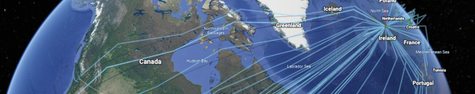

# ADIF Transformer



[ADIF Transformer](http://adifweb-env.eba-saseumwd.eu-west-2.elasticbeanstalk.com/) produces beautiful visualizations of your QSOs  in [Google Earth](https://earth.google.com).

## TL;DR (I don't want to read the manual)

Select your file and click `Process...` to obtain three output files:

- an enhanced ADIF file augmented with data from QRZ.com and activity references including
operator name and location
- a [Google Earth](https://earth.google.com) Project (KML) file
- a [Markdown](https://www.markdownguide.org/) table of contacts that can be pasted into a [Discourse](https://www.discourse.org/) server such as [SOTA Reflector](https://reflector.sota.org.uk/) or [WOTA Discourse](https://discourse.wota.xyz/). 

If you are a fixed station you must have your location set in QRZ.com for the ADIF Transformer to determine your location.

If portable, mobile, alternative, or with no fixed station data in QRZ.COM then let the transformer know where you are, either by specifying an activity reference, or directly entering your location. You can use right-click on [Google Maps](https://maps.google.com) to find your Latitude & Longitude and paste that string directly into the form.

## How It Works (or a bit more info)

Most folk are primarily interested in visualizing their QSOs in Google Earth, so we'll look at that first. 

There are a number of steps the ADIF Transformer performs as it turns your ADIF file into a Google Earth KML project file.

### Determining Your Station Location

Lots here depends on whether you are operating from a fixed location or portable. 

If you are fixed the simplest solution is to ensure your QRZ.COM entry has a latitude & longitude for the most accurate location. 

If you aren't a fan of QRZ.COM you can override your location on the form either by specifying a latitude or longitude, or alternatively a Maidenhead Locator. 

If you want to make obscure your location a bit then specify a 6 or 8 character locator rather than the most accurate 10 charater version.

### Determining Other Station Locations

For each of your hard earnt contacts ADIF Transformer attempts to determine a location. It does this using a number of techniques, in order of accuracy:

1. A `LATITUDE` and `LONGITUDE` in the ADIF file.
1. Their Activity location (in the `SIG` and `SIG_INFO` or `SOTA_REF` fields of the ADIF input file).
1. Location in QRZ.com, preferring Latitude & Longitude if set over Maidenhead locator.
1. A maidenhead locator in the ADIF file `GRIDSQUARE`.

#### Stations without a location

Where no location can be determined a warning is issued, and the station isn't added to the Google Earth KML file. You can correct this by adding an activity for the station, or by specifying their `LATITUDE` and `LONGITUDE` in the ADIF input file or their `GRIDSQUARE` reference.

### 2. Adding Station Information from QRZ.COM

In order to enrich the ADIF output file, and provide more information when you click on a station icon in Google Earth) a lookup is made for additional station information from [QRZ.COM](https://qrz.com). 

The initial lookup is for the callsign as logged, but for some callsigns more work is required to determine the information.

The worst case is a portable operator abroad. It is unlikely the operator has created a specific QRZ.COM page for this callsign. I'll use examples to show how the application tries to determine the most accurate information.

When operating on holiday in Spain I used the callsign `EA7/M0NOM/P`. If you had a contact with me and used the ADIF Transformer it would check QRZ.COM for the following callsign variants in order:

- `EA7/M0NOM/P`
- `EA7/M0NOM`
- `M0NOM/P`
- `M0NOM`

The UK complicates this a little more, as a Scottish operator `MM0XRT` activating a HEMA summit in Wales would be `MW0XRT/P`. In this case QRZ.COM would be queried with UK country callsign variants:

- `MW0XRT/P`
- `MW0XRT`
- `M0XRT/P`
- `M0XRT`
- `MM0XRT/P`
- `MM0XRT`
- `MI0XRT/P`
- `MI0XRT`
- `MD0XRT/P`
- `MD0XRT`
- `MG0XRT/P`
- `MG0XRT`

As soon as a variant matches in QRZ.COM the search stops. I've almost certainly only scratched the surface on this process!

### 3. Selection of Station Icon

There are a number of icons that are used to mark a station, based on the station suffix and any 
activity that is associated with the station.

|Icon|Suffix|Activity Type|
|----|------|--------|
|House|none|none|
|Mountain|/P|SOTA|
|Red 'H'|/P|HEMA|
|Park Bench|/P|POTA|
|Hiker following Trail|/P|WOTA|
|Tree|/P|WWFF|
|Hiker|/P|None|
|Sailing Boat|/MM|none|
|Car|/M|none|

### Drawing the QSO

ADIF Transformer uses a simple propagation visualization technique based on an ideal antenna. For HF signals this gives an idea of the minimum number of hops your QSO would have needed to reach the target station.

## More about ADIF Transformer

Virtually all Ham Radio Logging programs have the ability to produce ADIF files. ADIF stands for
_Amateur Radio Interchange Format_ and was designed to allow logging applications to export and import 
contacts without loosing any information. As such it supports a large number of fields designed to capture every aspect of a QSO.

If your logging program is connected to [QRZ.COM](https://qrz.com) and you have an XML Subscription membership then you may find that details are automatically pulled from QRZ.COM about the other station and added to your contact. These will be exported by the logging program in ADIF.

However, if you use a program such as Fast Log Entry, or your logging program isn't connected to QRZ.COM or you don't have an XML subscription then the data that you enter as part of the QSO log will be the  total information available in the ADIF export.

The ADIF Transformer gives you the opportunity to add information about the station you have worked both from QRZ.com, activity references and using specially-formatted name/value pairs in the comments field, where your logging program doesn't have the ability to add data directly.

This works really well for Fast Log Entry, where only the SOTA reference, WWFF reference or 6 character Maidenhead locator can be specified for the contacted station.

## The ADIF format 30 second Primer
[ADIF](http://adif.org/) _Amateur Data Interchange Format_ is a text file representation for Amateur radio contacts. It is a popular
output format for logging programs. The [ADIF specification](https://adif.org/312/ADIF_312.htm) describes the valid content of the header and record fields.

An ADIF file consists of two sections:

- header
- records

### Fields in an ADIF file
Each field in the file is proceeded by a field name separated by the length of the field value with a colon.
For example: `<PROGRAMID:3>FLE` indicates the field is `PROGRAMID` and the text contained in the field
is `3` characters long with a value of `FLE`.

### Header
The header contains information about the program that generate the file and the ADIF version, for example:

```
ADIF Export for Fast Log Entry by DF3CB
<PROGRAMID:3>FLE
<ADIF_VER:5>3.1.0
<EOH>
```

The header is terminated with the `<EOH>` marker.

### Records

Each record captures all the details of a QSO for both the recording station and the contacted station.
A record is terminated by the `<EOF>` marker.

Here is an example entry in a [Fast Log Entry](https://df3cb.com/fle/) input file:

```
40m ssb 7.090
1258 g7las/p 7.188 <OP: Rob, PWR: 50, GRID: IO81LC, HEMA: G/HWB-026>
```

This is the ADIF record generated by [Fast Log Entry](https://df3cb.com/fle/). These
are typically stored on one line. In this case I've separated
each field of a record into a single line:

```
<STATION_CALLSIGN:7>M0NOM/P 
<CALL:7>G7LAS/P 
<QSO_DATE:8>20210522 
<TIME_ON:4>1258 
<BAND:3>40m 
<MODE:3>SSB 
<FREQ:5>7.188 
<RST_SENT:2>59 
<RST_RCVD:2>59 
<COMMENT:47>OP: Rob, PWR: 50, GRID: IO81LC, HEMA: G/HWB-026 
<QSLMSG:44>Thx for QSO from Winter Hill io83ro G/SP-010 
<MY_SOTA_REF:8>G/SP-010 
<OPERATOR:5>M0NOM 
<MY_GRIDSQUARE:6>IO83ro 
<EOR>
```

Note that the QSO has a `<STATION_CALLSIGN:7>` (me) and a `<CALL:7>` G7LAS/P who is on the other end, a date and time, frequency, band, mode, signal reports,
my SOTA reference `<MY_SOTA_REF:8>`, the operator (basically my callsign without any modifiers) and my Maidenhead
Locator in `<MY_GRIDSQUARE:6>`.

Of interest is the comment line, which we will examine further, as this is one of the key features of post-processing.
In the comment line:

`<COMMENT:47>OP: Rob, PWR: 50, GRID: IO81LC, HEMA: G/HWB-026
`

You will notice that it consists of a number comma-separated key-value pairs. For example, the first
pair key is `OP` with value `ROB`, then `PWR` value `50` etc.


## Activities

The ADIF Transformer knows about _activities_. The term _Activity_ is used to describe a special activity
that you or the contacted station are participating in. For example: Summits on the Air or Parks on the Air. For
each activity the ADIF Transformer loads the database of activity references. The totals are currently:

- 28,229 Parks on the Air
- 330 Wainwrights on the Air
- 3,316 Humps on the Air
- 157,201 Summits on the Air
- 51,138 World Wide Flora Fauna areas

## The Comment Field in your ADIF file

The ADIF Transformer looks carefully for key: value pairs in the comment field in your ADIF input file. It recognises a keywords. 

For example a comment like: `HEMA: G/HLD-001, OP: Mark, RIG: FT-817, PWR: 5`
Would result in the following ADIF fields being set:

|ADIF Field|Value|
|----------|-----|
|NAME|Mark|
|SIG|HEMA|
|SIG_INFO|G/HLD-001|
|RIG|FT-817|
|RX_PWR|5|

### Comment Name/Value pairs that will be processed

|Description|Comment Key|Sample  Value|Target ADIF Field|
|-----|------|--------------------|-----------------|
|Summits on the Air|SOTA|G/LD-001|SOTA_REF|
|Humps on the Air|HEMA|G/HLD-001|SIG/SIG_INFO|
|Worldwide Flora Fauna|WWFF|GFF-0233|SIG/SIG_INFO|
|Parks on the Air|POTA|G-0190|SIG/SIG_INFO|
|Wainwrights on the Air|WOTA|LDW-001|SIG/SIG_INFO|
|Operator Name|OP|Mark|NAME|
|Home/Location|QTH|Windermere|QTH|
|Rig Model|RIG|IC-7100|RIG|
|RX Power|PWR|50|RX_PWR|
|Age|AGE|52|AGE|
|Islands on the Air|IOTA|E-145|IOTA|
|Maidenhead Locator|GRID|IO84MJ (6/8/10 char)|GRIDSQUARE|
|Serial No Transmitted|STX|0045|STX|
|Serial No Received|SRX|0034|SRX|
|Fists No|FISTS|18162|FISTS|
|QSL Status|QSL|D/B|QSL_DATE/SQL_SENT|
|Latitude|LAT|50.153|LATITUDE|
|Longitude|LONG|2.345|LONGITUDE|

I will accept requests to map additional fields - these are the most frequently fields used by me,
and there are a log of them!

## Background

The ADIF Transformer started as a project to allow me to add additional information in the comment field of a [Fast Log Entry](https://df3cb.com/fle/) input file. This means I can specify things like operator name, rig,  activity reference, that couldn't be populated directly from [Fast Log Entry](https://df3cb.com/fle/).

As I like to record the contacted station location as accurately as possible I then decided to add
support for up-to 10 character [Maidenhead Locator](https://www.dxzone.com/grid-square-locator-system-explained/) references and at that point stumbled across the idea of visualizing QSOs using Google Earth.

## Source Code

ADIF Transformer is written in Java as a Spring Boot Application. It makes use of the following libraries:

- ADIF 

## Future Directions

- Improve the propagation model
- Save and Load Preferences
- Customizable Markdown table fields
