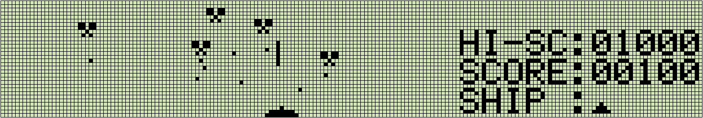

### Cosmic Fly stand-alone version (for FX-870P/VX-4)

Casio's Pocket Computer VX-4 and FX-870P games are almost non-existent on the internet. 

The games for the PC-G850 series, which is made by Sharp and is a school education model like the VX-4, 
are in contrast to the flood of games on the internet. This situation is the reason why I opened 
the "Casio VX-4 (Pocket Computer) page", but the lack of information about the VX-4 is a problem. However,

Jun Amano's "Casio PB-1000 forever ! " It felt like a high threshold for beginners.

 - After installing the file management utility "VX-Menu" (for PB-1000), transfer the game file to 
   the pocket computer, save it, and run it.
 - There is also a version that can be played with normal BASIC without using VX-Menu, 
   but even in that case, when the program is run, it displays `CONNECT:` 
   and requests an RS-232C connection. To play, you have to connect RS-232C and send a binary
   file from your PC. After that, the game will be started with **MODE110 (execution address)**.

Both methods are excellent in terms of utilization efficiency of the user memory of the pocket computer, 
but it is far from the situation where a person unfamiliar with VX-4 loads and runs. 

Therefore, although the memory usage efficiency is poor, it would be convenient if there was a 
standalone version that automatically loads and executes machine language by embedding a machine 
language program in a BASIC program with a DATA statement, which is one of the common methods 
for Pocket Computers.

I made a standalone version of Mr. Ao's "Cosmic Fly" (all machine language). 

Cosmic Fly is the original Public Domain software that Mr. Gernot Fink of Germany programmed for PB-1000. 
It's a thing. The picture below is an image of the execution screen.

This time, through Mr. Jun Amano, Mr. Ao gave me permission to publish it here, so I will publish it here.

[Click here to download CosmicV4.zip](../../archives/CosmicV4.zip).

The target machines are FX-870P and VX-4, but VX-4 that does not have 32KB and RP-8 and RP-33 that 
do not have expanded memory are excluded . This is because the size of the executable program 
is a little less than 6KB, so the VX-4, which has only 8KB of RAM, cannot even load files with `F.COM`.

The operation procedure up to the game is as follows.
1.	Transfer `CosmicV4.bas` in `CosmicV4.zip` (and `clr.b` if the extension **CLEAR** for securing the machine 
language area is not installed in the pocket computer) from the PC to one of the program areas 
P0 to P9 of the pocket computer. increase. Any transfer software on the PC side is fine,
but PB-1000 Data Communicator32 ver.1.31 is convenient.
2. On the pocket computer side, load with F.COM. In the case of RS-232C, it is necessary to match 
   the communication conditions of both.
3. Allocate a 1520-byte machine language area with extended **CLEAR**. In the case of `clr.b`, if you run it first,
   `MODE110(&H18F5)` is displayed, so execute **MODE110(&H18F5),1520** [EXE] in command mode to secure the machine 
   language area. Also, if you have already installed `CLEAR-ZERO`, execute **MODE110(0),1520** [EXE]
4. RUN `CosmicV4.bas`. This time, we use a quick loader with improved readability, operability, and portability. 
   This loader works like this:
   - If the machine language area allocated by extended `CLEAR` is insufficient, issue a warning and exit.
   - If the first 24 bytes of the machine in the machine language area are identical to the data, do not load the machine language.
   - Display the load size on the way (The load time is slightly less than double, but if you want to speed it up, 
     please comment the `PRINT` part).
   - With this kind of behavior, once you load it, you can basically start Cosmic Fly by **RUN** without 
     thinking about anything.
   - However, if you want to secure the user area, delete CosmicV4.bas with F.COM's **NEW** command. 
     Even in that case, Cosmic Fly's machine language program remains in the machine language area, 
     so Cosmic Fly can be started by executing **MODE110(7376)**[EXE]

4.	The game is an orthodox invader type game. Move the SPACE SHIP left and right to avoid the balls 
    that the enemy's Cosmic Fly shoots and SHOT to destroy the Cosmic Fly. Key operations are
    
    [EXE] ... start game,
    [BRK] ... end game,
    [ 4 ] ... move SHIP left,
    [ 6 ] ... move SHIP right,
    [ 0 ] ... shot Launch

Also, as an important note, if you run a C program in C language mode, the data in the machine language area 
will be destroyed, so the Cosmic Fly machine language program loaded in the machine language area will also be 
destroyed. It will be. Even in such a case, `CosmicV4.bas` has a simple check function that automatically
loads the machine language into memory if there is no Cosmic Fly machine language or if it is destroyed, 
so you can run it without thinking about anything. If you try to start Cosmic Fly manually
with **MODE110(7376)**, it will run out of control.

### PS
1. I would like to express my gratitude to Mr. Ao and Mr. Jun Amano for not only Cosmic Fly, 
   but also for giving me various valuable information about the VX-4 through their HP.
2. A standalone version of "Casio PB-1000 forever!" will soon be incorporated into Jintori (so-called Reversi).
