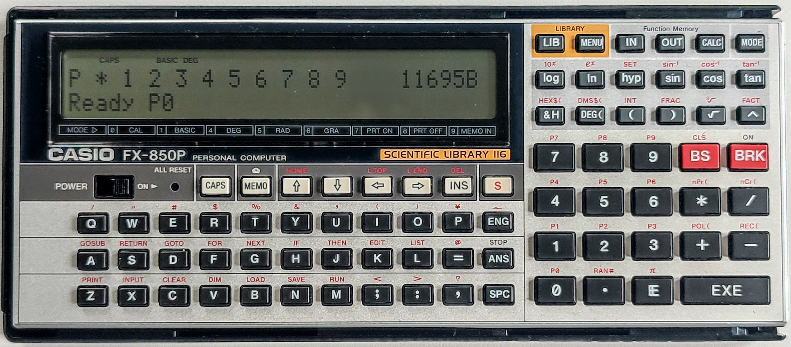

# Casio FX-850P/FX-880P Owners Manual

This is a reproduction of the documentation in 
the [Casio FX-850P Owners Manual](manuals/Casio_FX-850p_Owners_Manual.pdf) PDF
in Markdown format for easy reference.

*Initially it focuses on the parts of the manual that relate to BASIC programming.*

---

## CONTENTS

1. [Unit Configuration](part-1-unit-configuration.md) *TODO*
2. [Fundamental Operation](part-2-fundamental-operation.md)  *TODO*
3. [Calculation Function](part-3-calculation-function.md)  *TODO*
4. [Formula Storage Function](part-4-formula-storage-function.md)  *TODO*
5. [Data Bank Function](part-5-data-bank-function.md)
6. [BASIC Programming](part-6-basic-programming.md)
7. [Peripheral Devices](part-7-peripheral-devices.md)
8. [PB-100 Series Compatibility](part-8-pb-100-series-compatibility.md)  *TODO*
9. [File Handling Fundamentals](part-9-file-handling-fundamentals.md) *TODO*
10. [Command Reference](part-10-command-reference.md)
11. [Scientific Library](part-11-scientific-library.md) *TODO*
12. [Appendices](part-12-appendices.md) *TODO*
13. [Specifications](specifications.md)  *TODO*

## SUPPLEMENTAL

A concise language reference:
 - [Casio Basic Language Reference](casio-basic-language-reference.md)

---

*Casio FX-850P*
