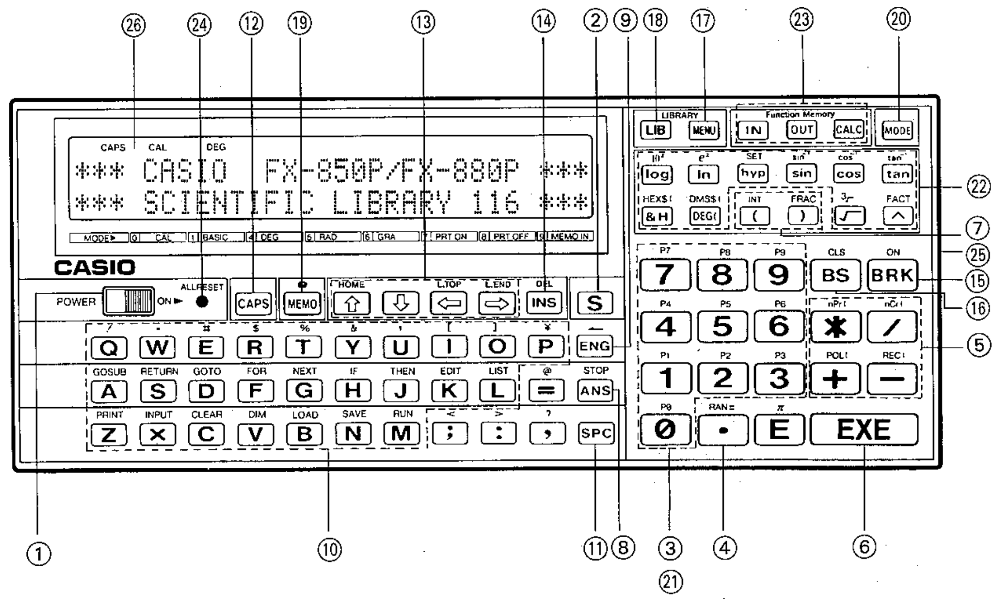

*back to [CONTENTS...](casio-fx850-owners-manual.md)*

# PART 1 - UNIT CONFIGURATION

## General Guide

1. Power Switch
2. Shift Key
3. Numeric Keys
4. Decimal Key
5. Arithmetic Operator Keys
6. Execute Key
7. Parentheses Key
8. Answer Key
9. Engineering Key
10. Alphabet Keys
11. Space Key
12. CAPS Key
13. Cursor Keys
14. Insert/Delete Key
15. Break Key
16. Backspace/Clear Screen Key
17. Menu Key
18. LIB Key
19. Memo Key
20. Mode Key
21. Program Area Keys
22. Function Keys
23. Formula Storage Key
24. ALL RESET Button
25. P Button
26. Screen

## OPERATIONAL FUNCTIONS
