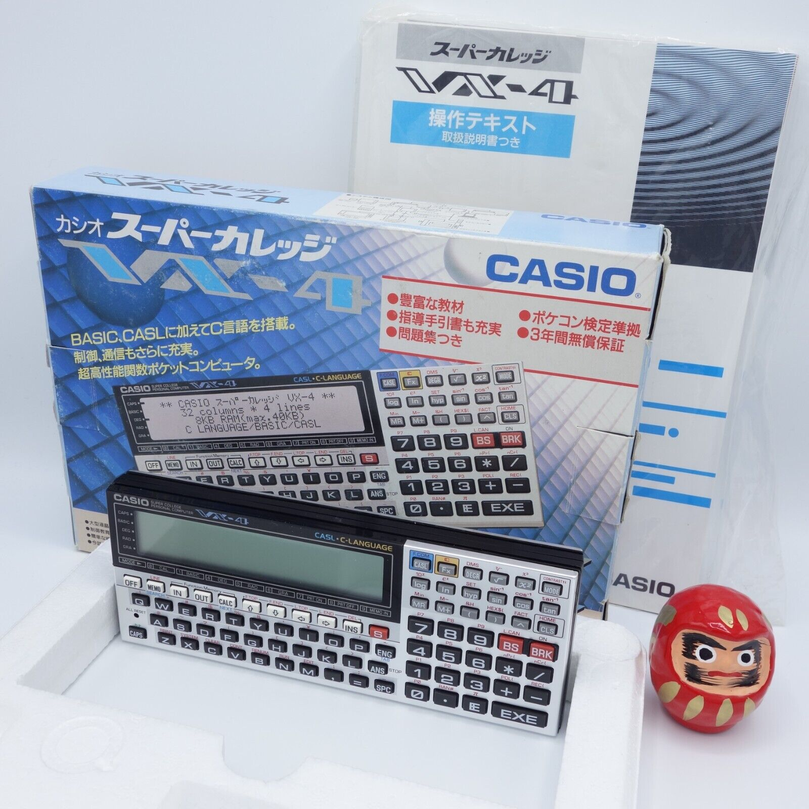

# casio-basic
*A Casio Basic Project - Parser and Interpreter*

This is my entry for the
[Retrochallenge 2022/10 Competition](https://www.retrochallenge.org/p/entrants-list-202210.html) and probably
subsequent challenges.

The Casio Pocket Computer range use a fairly standardized version
of BASIC called [Casio PocketPC BASIC](http://foroplus.com/basic/casiopbasic.php). This project is to create a parser for
BASIC using the programming language [Scala](https://scala-lang.org)
and the parser library [fastparse](https://github.com/com-lihaoyi/fastparse).

I have a couple of different Casio computers - I had a
[Casio PB-410](https://ithistory.org/db/hardware/casio-computer-co-ltd/casio-pb-410) when I was a kid and loved it.
Arguably the top-of-the-range model is the [FX-850P](http://www.computinghistory.org.uk/det/20339/Casio-FX-850P/). I now own one of these
and have built a cable that allows me to download and upload files. This will allow
me to confirm correct behaviour of the parser/interpreter.

*Casio FX-850P*

## 24-OCT-2022

So all the effort I've put into the [Converter](https://github.com/urbancamo/casio-basic/blob/main/src/main/scala/uk/m0nom/casio/basic/converter/Converter.scala) Scala
code has now paid off. The converter, as well as converting between Casio Basic ASCII and Unicode can now output a useful
markdown table showing the conversion mapping which can be seen on the [documentation page](doc/casio-ascii-to-unicode-converter.md) for the converter.

I've also been able to convert all the BASIC applications which form the Scientific Library built into the FX-850P & FX-880P.
[Part 11 - Scientific Library](doc/part-11-scientific-library.md) of my online manual now has a list of all the library routines including links 
to both the Unicode and Casio Basic source files. Having the Unicode versions available makes reading the BASIC source code,
containing all sorts of mathematical characters, really nice online.

What I didn't realise when I set out to write a parser for Casio BASIC is that a converter is a pre-requisite in order
to process text within a Scala application using Unicode, so even though I've not made much progress on a parser I had
to go down this route anyway!

Oh... and my VX-4 arrived. It comes with 8KB RAM which is pretty useless, so I ended up ordering a modern-day replacemnt
for the Casio RP-33 32KB RAM expansion module. See the developer [Birt's YouTube page](https://www.youtube.com/c/HeyBirt) which 
includes [part 1](https://www.youtube.com/watch?v=G3BDkjh6kNQ&t=6s) and [part 2](https://www.youtube.com/watch?v=DSXBF3-MclE&t=619s)
of his video explaining the design of the replacement. They are currently available on eBay, his seller account
is [jeff_burt](https://www.ebay.co.uk/usr/jeff_birt).

I got the module installed today and am looking forward to exploring the machine, including the enhanced version of Casio Basic when
this RC entry is complete.

## 23-OCT-2022

I'm not making progress on the parser - but I am making progress on a conversion utility to convert Casio BASIC character
set pseudo-ASCII files into Unicode and back again. This is really a prerequisite to the parser, which works on the 
Unicode character setup. I've had fun-and-games with Unicode and Java/Scala because the 16-bit+ characters can't be stored
in a Java char - you must resort to converting character strings with more than one character into Unicode code points.

I also re-organised the Casio Basic documentation to mirror the standard owners manual, albeit with sections missing
at the moment that don't relate to BASIC. The new link is [Casio FX-850 Owners Manual](./doc/casio-fx850-owners-manual.md).

## 09-OCT-2022

The [Casio Basic Language Reference Manual](code/urbancamo.github.io/casio-basic/doc/casio-fx850-owners-manual.md) is now 
fairly complete. On to the parser...

## 06-OCT-2022

Spent an hour entering documentation pages in Markdown format, will continue
to do so although this may become more of a background task moving forward, so
I can make progress on the parser. As far as I know there are no machine-readable versions of the documentation, so I see this as a worthwhile
endeavour.

Oh, and eBay beckoned, so I now have a Casio VX-4 being shipped from Japan.
This is a *very* interesting pocket computer, with support for C-language
programming. It was never exported, so all the documentation is in Japanese,
so it might turn into a more worthwhile project when it arrives converting the
documentation into English form - again, I'm unaware anyone has attempted
this.

*Casio VX-4*

## 04-OCT-2022

Started documenting [Casio Basic](doc/casio-basic-language-reference).

## 03-OCT-2022

First update! At the moment I am scouring the internet for Casio Pocket
Computer resources - I'll make a comprehensive resources list.

My first proper task will be to document the Casio Basic dialect, with all
options for the FX-850P. The language evolved as new models were released.

I've also found some sample programs which will be really useful when testing
the parser.

----
This project is hosted on [GitHub](https://github.com/urbancamo/casio-basic).

Follow me on Twitter as [@urbancamo](https://twitter.com/urbancamo).
