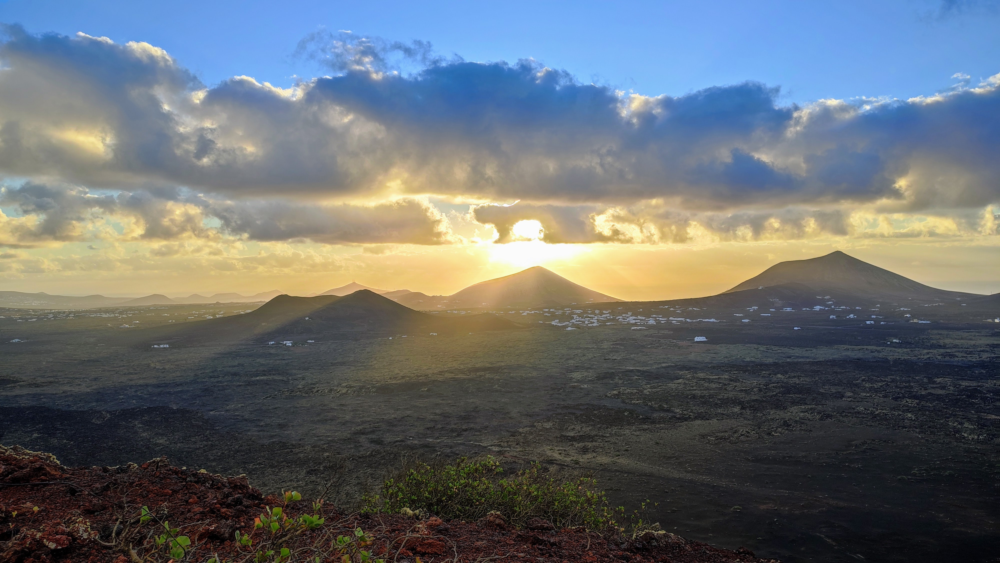

## Activation of Montaña Colorada on Lanzarote

With [Rob](https://www.qrz.com/db/G7LAS) recently adding Lanzarote to the [HEMA](http://hema.org.uk/) programme I took
the opportunity to be the first activator of a HEMA summit on this wonderful island!

Having done my research I found that Montaña Colorada is on the Easterly edge of the _Parque Natural Los Volcanes_
which means it also qualifies in the [Parks on the Air](https://pota.app) and [World Wide Flora Fauna](https://wwff.co)
programmes.

- HEMA Reference: [EA8/LA-004](http://hema.org.uk/fullSummit.jsp?summitKey=60103)
- POTA Reference: [EA-0215](https://pota.app/#/park/EA-0215)
- WWFF Reference: [EAFF-0069](https://wwff.co/directory/?showRef=EAFF-0069)

Mike [2E0YYY](https://www.qrz.com/db/2E0YYY) had arranged to be portable around the same time from HEMA summit 
_Strawberry Hill_ [G/HNP-026](http://hema.org.uk/fullSummit.jsp?summitKey=5309) and it was hoped that we would
both be able to make contact with Australian stations Ernie [VK3DET](https://www.qrz.com/db/VK3DET) and 
Ian [VK3YFD](https://www.qrz.com/db/VK3YFD) as well as Ed [DD5LP](https://www.qrz.com/db/DD5LP) in Germany.

### About Los Volcanes Natural Park

There are many articles online about the park, but suffice to say it should be on your list of places to 
visit if you are holidaying on Lanzarote. Here is one description that sums it up well:

_This is terrain of volcanic origin with strange, curious formations which emerged from the solidification of
the lava. The presence of vegetation is very scarce, except in the areas with the oldest materials, 
prior to the last eruptions in the 18th and 19th centuries. Lichens proliferate here, 
there being almost a hundred different species. In the fresher areas the wild geranium, 
St. John's wort and the Canary Island aeonium are common. As for the fauna, the reptiles and birds, 
who have adapted well to the exceptional conditions of the park, dominate._ [ref](https://www.spain.info/en/nature/volcanes-natural-park/)

### Montaña Colorada 

Montaña Colorada was the last of the volcanic explosions that created Volcanes National Park from in 
Lanzarote 1730-1736. 

Parking can be found by searching Google Maps for
[Aparcamiento Montana Colorada, Tinajo](https://www.google.com/maps/place/Aparcamiento+Montana+Colorada/@29.0047073,-13.6859487,17z).
There is a flat walk with information signs that skirts round the base of the Volcano which is easy underfoot. About
1km in is the obvious path for ascending to the summit and marked on most terrain maps.

_Car Parking_

### The Ascent

When I arrived it was still dark. It was windy which is very common on Lanzarote! I had bought my head-torch 
just in case of an early morning or evening activation and that was put to good use on the ascent. The flat
path is very easy underfoot. The ascent is on loose, small gravel from volcanic rock. It is fairly easy going
with shoes/boots with a decent grip on them. The last 25 metres is steeper and requires some extra care to
avoid slipping. Obviously the descent is if anything worse, I wouldn't be attempting this is standard trainers.
I wear trail shoes normally (although I get through them very quickly as the tread pattern is very soft) and they
were ideal for this terrain. Also note that volcanic rock is very sharp, and even just lifting myself off from
a seated position I managed to cut my wrist!

The summit is marked with a small cairn stone pile. Views are 360 degrees with the National Park to the West.

### The Radio

The SFI was above 100 with the K index around 1 so I was expecting good things for the radio. I was using my
FT-817ND with Super Antenna MP1. With the 817 I use LifePo4 2200 mAH cells from HobbyKing, terminated in powerpoles
and these run the rig at around the same voltage as the internal battery, starting just over 10 volts and running
out around 9 volts.

I set the antenna up just on the leeward side of the summit, about 0.5m below to shelter from the worst of the 
wind.

Initially I spotted on the HEMA Facebook Group, then subsequently both the Parks on the Air and WWFF spot systems.
I don't think POTA brought in any contacts (it was a bad time of day for the USA where most POTA contacts originate) but
I think the WWFF spot definitely brought in some chasers. When the frequency I was working `14.287 SSB` dried up
I found that Mike was in QSO with Ed [DD5LP](https://www.qrz.com/db/DD5LP), Ian [VK3YFD](https://www.qrz.com/db/VK3YFD) 
and Ernie [VK3DET](https://www.qrz.com/db/VK3DET). Ian was always weak with me, generally not moving the meter but
Ernie came up to around 58 on the peak of the opening. 
I had a confirmed QSO with Mike [2E0YYY](https://www.qrz.com/db/2E0YYY), making this the first
HEMA S2S with a Lanzarote summit and also with Ernie [VK3DET](https://www.qrz.com/db/VK3DET) which is quite incredible on 5 watts!

I had also posted on the [FISTS CW groups.io mailing list](https://fistscw.groups.io/g/main) that I would be operating
CW and tried therefore to use the FISTS recommended frequency of `14.058` when I did my 20m CW activation. I'm not
sure where the chasers originated, but the 
[Reverse Beacon Network](http://www.reversebeacon.net/dxsd1/dxsd1.php?f=0&c=ea8%2Fm0nom%2Fp&t=dx) did hear me once:

I also spotted for 20m CW on the WWFF spotter.

I moved to 15m to catch [Simon G4JPX](https://www.qrz.com/db/G4JXP) who was activating Lanzarote SOTA summit
[EA8/LA-002](https://summits.sota.org.uk/summit/EA8/LA-002) Atalaya de Femes. He must have been using the same
frequency as a couple of days ago as he was booming in 59+ as soon as I changed band on the FT-817ND. I only
had one contact after a spot on WWFF on 15m.

## Photos

Amazing to watch the sunrise over this magnificent landscape.

All photos, including some stunning panoramas, are in a [Google Photos album](https://photos.app.goo.gl/E4djNoaNbNVPMwii6).

## The Log Book

|TIME |CALLSIGN    |    FREQ| BAND|MODE|RST|RSR|OPERATOR           |SIG |REF       |COMMENT                     |
|-----|------------|--------|-----|----|---|---|-------------------|----|----------|----------------------------|
|07:04|G4IAR       |  14.287|  20m| SSB| 51| 33|Dave BROOKS        |    |          |                            |
|07:09|2E0ESY/M    |  14.287|  20m| SSB| 51| 51|MIKE Clitheroe     |    |          |                            |
|07:10|UT5PI       |  14.287|  20m| SSB| 55| 55|Valery V. Ageenko  |    |          |                            |
|07:11|S52RA       |  14.287|  20m| SSB| 55| 57|                   |    |          |                            |
|07:12|S58AL       |  14.287|  20m| SSB| 57| 57|ALBERT JAVERNIK    |    |          |                            |
|07:12|MW0ISC      |  14.287|  20m| SSB| 55| 55|Stephen Charles    |    |          |                            |
|07:13|OH1MM       |  14.287|  20m| SSB| 55| 59|Pasi Alanko        |    |          |                            |
|07:18|G0OUF       |  14.287|  20m| SSB| 59| 55|John               |    |          |OP: John, RIG: IC-7300, ANT:|
|07:25|DD5LP       |  14.280|  20m| SSB| 58| 53|Edward A Durrant   |    |          |                            |
|07:27|2E0YYY/P    |  14.280|  20m| SSB| 57| 57|Mike Hunter        |HEMA|G/HNP-026 |HEMA: G/HNP-026             |
|07:44|VK3DET      |  14.294|  20m| SSB| 58| 54|ERNIE TURNER       |    |          |                            |
|08:08|M0BMX       |  14.289|  20m| SSB| 55| 55|Mel Fitchett       |    |          |                            |
|08:09|ON4ON       |  14.289|  20m| SSB| 58| 57|DANNY COMMEYNE     |    |          |                            |
|08:09|DL8NDG      |  14.289|  20m| SSB| 59| 57|Axel Bienefeld     |    |          |                            |
|08:09|OM5DP       |  14.289|  20m| SSB| 59| 55|MARTIN SUBA        |    |          |                            |
|08:10|DL1EBR      |  14.289|  20m| SSB| 59| 59|Axel J. Feldner    |    |          |                            |
|08:10|2E0FEH      |  14.289|  20m| SSB| 55| 33|Karl Kruger        |    |          |                            |
|08:10|DM3CND      |  14.289|  20m| SSB| 58| 59|                   |    |          |Not on QRZ                  |
|08:19|DL2ND       |  14.058|  20m|  CW|599|559|Uwe Czaika         |    |          |                            |
|08:20|IW2NXI      |  14.058|  20m|  CW|599|599|Graziano (Grace)   |    |          |                            |
|08:23|OH5TQ       |  14.058|  20m|  CW|599|579|Pertti Paalanen    |    |          |                            |
|08:25|EA2DT       |  14.058|  20m|  CW|599|559|Manuel             |    |          |                            |
|08:25|OH1MM       |  14.058|  20m|  CW|599|559|Pasi Alanko        |    |          |                            |
|08:30|9A2KI       |  14.058|  20m|  CW|599|599|Istok Kapov - Ico  |    |          |                            |
|08:32|ON2CJ       |  14.058|  20m|  CW|599|599|Johan Carton       |    |          |                            |
|08:35|IK3HMB      |  14.058|  20m|  CW|599|559|GIORGIO PAVAN      |    |          |                            |
|08:37|DL5EBG      |  14.058|  20m|  CW|599|559|Walter Birkholz    |    |          |                            |
|08:41|GI0WLW      |  14.204|  20m| SSB| 59| 55|Stu                |    |          |OP: Stu, QTH: 30 miles west |
|08:49|EA8/G4JXP/P |  21.264|  15m| SSB| 59| 59|SCH Green          |SOTA|EA8/LA-002|                            |
|08:52|I4RHP       |  21.280|  15m| SSB| 59| 55|RODOLFO CAPPELLETTI|    |          |                            |
|09:08|MM5DWW      |  10.120|  30m|  CW|599|559|DAVID WISHART      |    |          |                            |

## Google Earth QSO Visualizations

Using the [ADIF Processor](https://www.adif.uk):

_S2S with EA8/G4JXP/P on EA8/LA-002_

