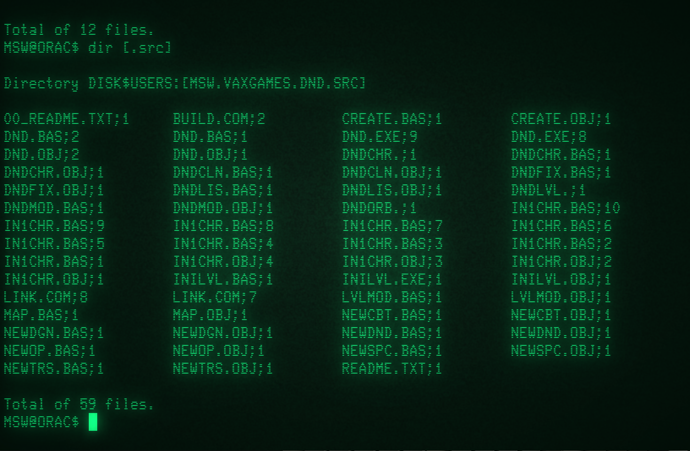
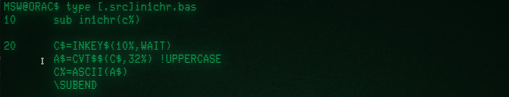
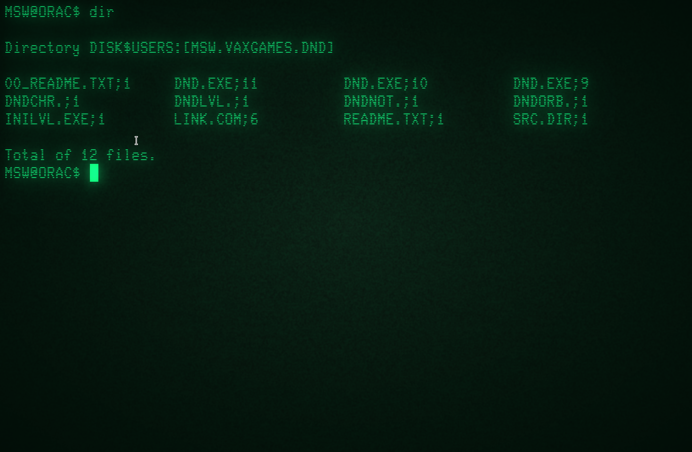
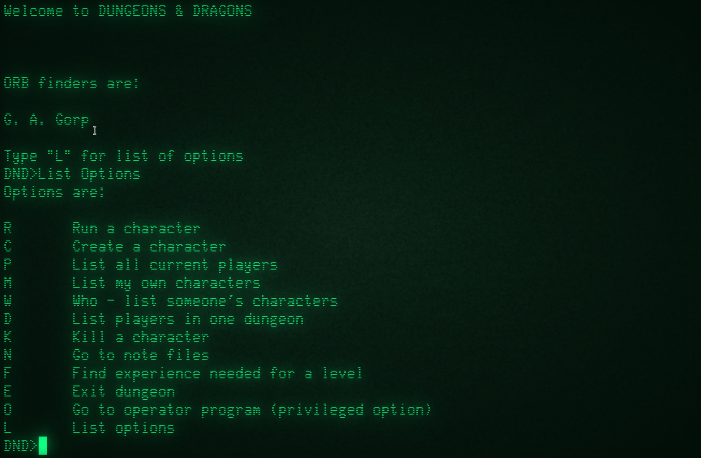
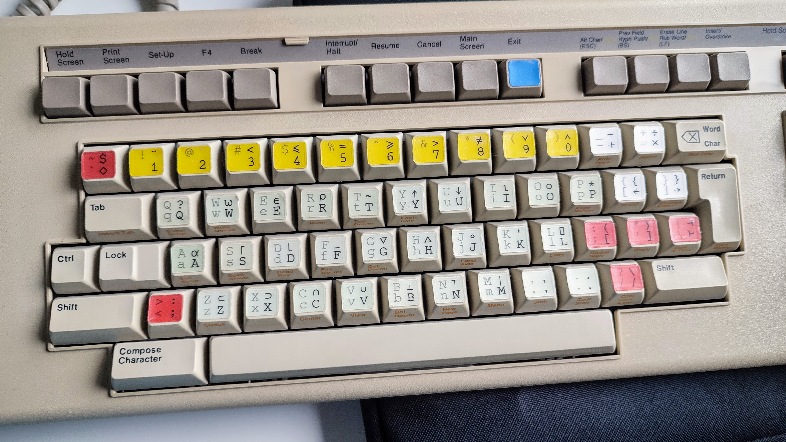
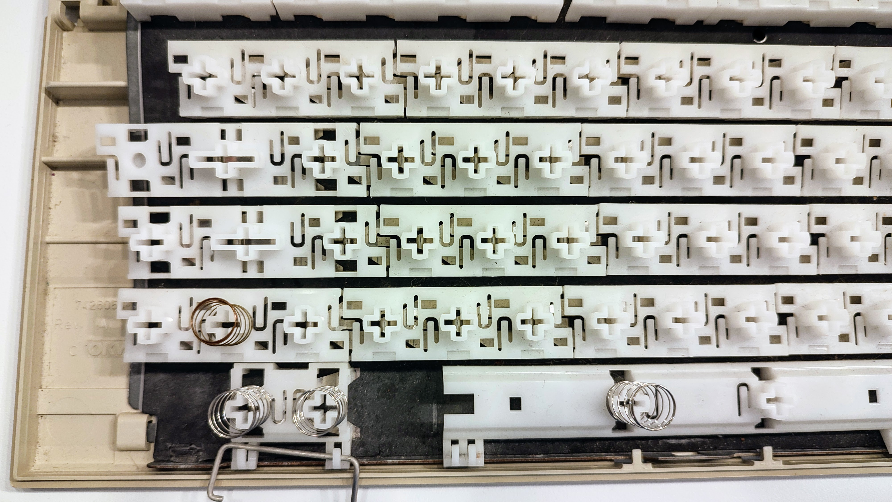
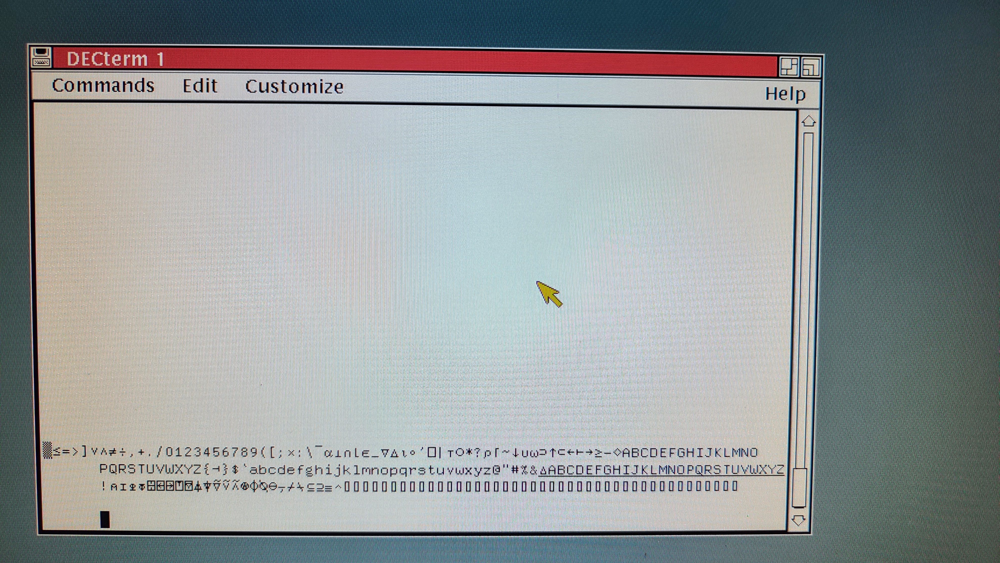
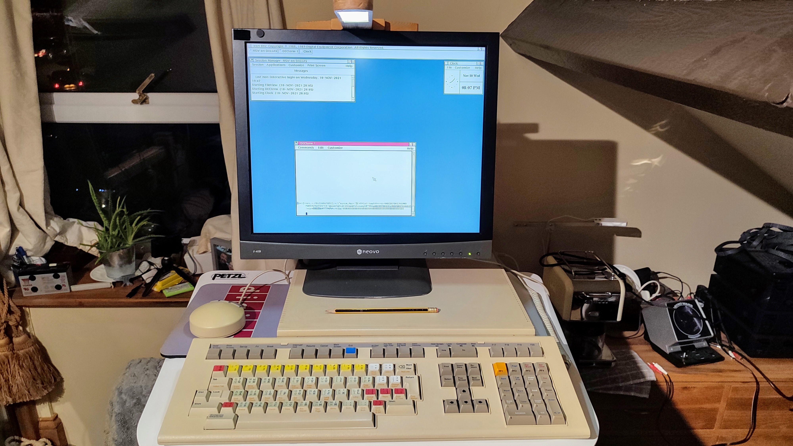

# Urbancamo's Retrochallenge Entry for 2021/10

## Second Update - 18-OCT-2021

Well, didn't get very far with my first goal, but together with Eric we have just reviewed all the projects
and one caught my interest: [Lee Adamson's DND Project](https://odysee.com/@Old.Computer.Fun:f). 

I spent a happy couple of hours watching his videos on Odysee. This evening I thought it would be fun
to try and get the latest VAX/VMS version of DND contained in his SVN archive: [VAXDND-3.0](http://svn.ocfco.net/public/DND/Historical%20Data/Original%20Archives/VMSDND-3.0/).

As always there is a bit of work to do to get to a working application. The `IN1CHR.BAS` implementation for the 
VAX/VMS version appeared to be missing as well as any compile or link scripts. In the end I had to come up with
my own version of IN1CHR. I'm not a VAX BASIC export, but I can cobble together a couple of lines. For that retro
experience I used [cool-retro-term](https://github.com/Swordfish90/cool-retro-term). Interestingly I had to 
go through two VMS boxes to get this to work. The VAX/VMS I run is Version 7.3 which doesn't support the
`SET TERMINAL/BACKSPACE` command so I had to go through my Alpha OpenVMS machine `SLAVE` to setup the terminal
before logging into the VAX.

I had to pull the binary files `DNDCHR`, `DNDLVL`, `DNDNOT` and `DNDORB` into the executable directory.

_Source Code Directory_

_My implementation of IN1CHR.BAS`

_Executable built using the @build and @link commands_

and then, drum roll, it runs on the SIMH VAX/VMS instance, compiled from source code:

_Running DND_

That's as far as I'm prepared to go, it's called finishing on a win! 
We'll try and play it another evening!

## First Update - 12-OCT-2021

Very late getting started on the project, mainly due to a keyboard failure. The DEC LK201 I have
stickered up for APL was poorly when I first used it after a while with a VAXstation 4000/90. 
I was able to determine it was probably the keyboard circuit that was faulty. At the 
recent [DEC Legacy](https://wickensonline.co.uk/declegacy/) event I was able to acquire another
keyboard and have successfully transplanted the keycaps onto the replacement keyboard structure and
controller. There was a number of ways I approached this but I took the time-consuming but lowest
risk approach.

So I finally have a VAXstation 4000/VLC running VAX/VMS 5.5 available to play with.

_The APL Stickered LK201_

_Keyboard Internals_

_VAX APL 4.4 running on the VAXstation 4000/VLC_

_The Ergonomic VAXstation setup_
