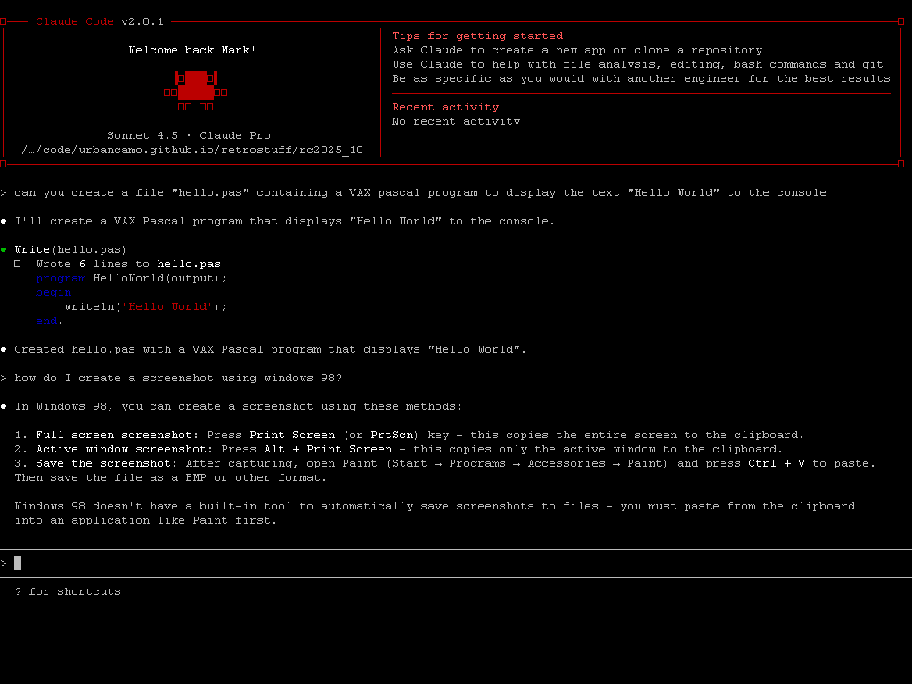
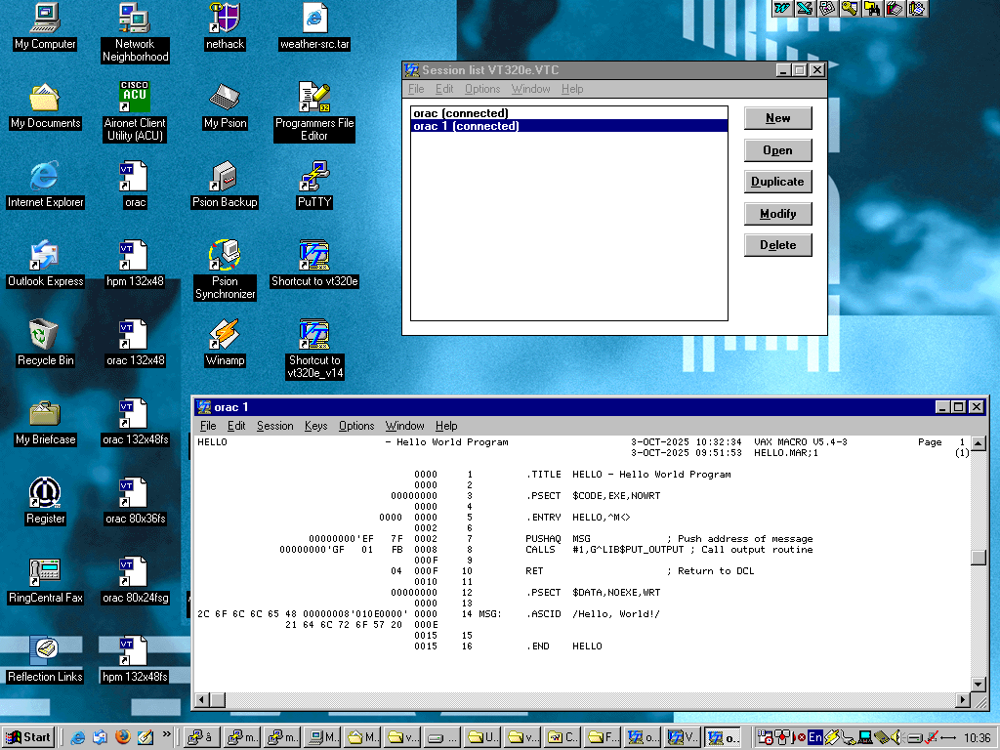

# Retrochallenge 2025/10

Main contest page: [https://retrochallenge.org/](https://retrochallenge.org/)


## Goals

Determine how good AI is at writing code for languages 
supported by the VAX/VMS operating system.

## Introduction

I've been using Claude Code for day to day development support when writing
code in Java, Scala, C# and other modern languages.

I'm curious to see how well it can handle older languages
like VAX BASIC, VAX Fortran and VAX Pascal.

I have an emulated VAXstation that has evolved over the years from an
original VAXstation 4000/90. The following languages are installed:

- VAX BASIC
- VAX Fortran
- VAX Pascal
- VAX C
- VAX C++
- VAX Macro Assembler
- VAX DCL
- VAX COBOL
- VAX APL
- VAX LISP

If I have time I may also install:
- VAX BLISS
- VAX ADA
- VAX PL/I

I'll spend a bit of time getting familiar with the languages again, and then
see how well Claude Code can help me write code in these languages.

I'll also see how well it can help me with DCL scripting.
I'll document my experiences here.

---

📍 [Jump to latest update](#04-OCT-2025)

---

## Updates

### 01-OCT-2025

Claude code has a terminal interface but I was unable to get it working with the 
retro-terminal emulator Reflection because it doesn't support UTF-8. I don't know
of a way to configure Claude to not display all the fancy terminal graphics, so it is 
pretty unusable which is a shame as other than the fancy graphics I could probably have
got this usable on my Windows 98 era Thinkpad. Instead I am using the Panasonic Toughbook
CF-31 which is running Ubuntu, although all I'm doing is ssh-ing into my HP Microserver
also running Ubuntu, but already setup for Claude Code (although I may switch to the laptop
if I decide this is the way to go).

Just as a starter for ten I thought I'd try a simple VAX Pascal Hello World program:

```
╭───────────────────────────────────────────────────╮
│ ✻ Welcome to Claude Code!                         │
│                                                   │
│   /help for help, /status for your current setup  │
│                                                   │
│   cwd: /home/msw/code/rc2025_10                   │
╰───────────────────────────────────────────────────╯

 Tips for getting started:

 1. Run /init to create a CLAUDE.md file with instructions for Claude
 2. Use Claude to help with file analysis, editing, bash commands and git
 3. Be as specific as you would with another engineer for the best results

> do you know how to program in VAX Pascal?

● Yes, I know VAX Pascal. It's a Pascal implementation by Digital Equipment Corporation for VAX systems, featuring extensions like
  variable-length strings, records with variants, and VAX-specific system calls.

  What VAX Pascal programming task can I help you with?

> can you write me a single hello world program

● program HelloWorld;
  begin
      writeln('Hello World');
  end.
```

I got an error compiling this file that I simply pasted back into the Claude code window:

```
> %PASCAL-E-OUTNOTDECL, (1) OUTPUT not declared in heading

● You need to declare the output file in the program header for VAX Pascal:

  program HelloWorld(output);
  begin
      writeln('Hello World');
  end.
```

The program then ran just fine on the VAX with the refinement:

```
MSW@ORAC$ type hello2.pas
program HelloWorld(output);
  begin
      writeln('Hello World');
  end.

MSW@ORAC$ pascal hello2.pas
MSW@ORAC$ link hello2
MSW@ORAC$ run hello2
Hello World
```

After this I asked ChatGPT if there was a terminal emulator that worked on Windows 98 that 
supports UTF-8. It answered that an old version of putty 0.60/0.61 had support for setting
the remote character set to be UTF-8, even though Windows 98 doesn't have any built in
support for the encoding. It also suggested Kermit 95 (which was a commercial offering at 
the time) had support.

So I downloaded and installed putty on the IBM Thinkpad Model 390 - this is a Windows 98
era Thinkpad I picked up a few months ago 'brand new old stock'. It has a Pentium II processor
and 64MB of RAM, with a 1024x768 display, build in CDROM and floppy disk drive. I'm using a 
Cisco Systems network card to access the internet via an unencrypted WiFi access point with
MAC address filtering.

I also had to get a reminder on how to create a screenshot on Windows 98! I was trying 
Ctrl-PrintScreen and Shift-PrintScreen but a full screenshot is just the button itself.
I am using the Reflection FTP client to move files between the Model 390 and the HP 
Microserver. I used ImageMagick to convert the screenshot from `bmp` to `png`.



## 03-OCT-2025

In a similar vein, I started asking Claude to generate code in other languages:

### VAX BASIC

```
MSW@ORAC$ type hello.bas
10 PRINT "Hello, World!"
20 END
MSW@ORAC$ basic hello
MSW@ORAC$ link hello
MSW@ORAC$ run hello
Hello, World!
```

### VAX C

```
MSW@ORAC$ type hello.c
     #include <stdio.h>
     int main() {
         printf("Hello, World!\n");
         return 0;
     }

MSW@ORAC$ cc hello
MSW@ORAC$ link hello
MSW@ORAC$ run hello
Hello, World!
```

### VAX C++

```
MSW@ORAC$ type hello.cxx
#include <iostream.h>

int main()
{
    cout << "Hello, World!" << endl;
    return 0;
}
MSW@ORAC$ cxx hello
MSW@ORAC$ link hello
MSW@ORAC$ run hello
Hello, World!
```

### VAX COBOL

The initial COBOL program created by Claude had indented text, but 
the VAX COBOL compiler, by default, expects text to start in the first
column, so having removed the initial whitespace on each line it then
worked correctly (I consulted `SYS$EXAMPLES:` for a sample COBOL program
to see what the issue was)

```
MSW@ORAC$ type hello.cob
IDENTIFICATION DIVISION.
PROGRAM-ID. HELLO.

ENVIRONMENT DIVISION.

DATA DIVISION.

PROCEDURE DIVISION.
MAIN-LOGIC.
    DISPLAY "Hello, World!".
    STOP RUN.
MSW@ORAC$ cobol hello
MSW@ORAC$ link hello
MSW@ORAC$ run hello
Hello, World!
```

### VAX DCL

```
MSW@ORAC$ type hello.com
$ WRITE SYS$OUTPUT "Hello, World!"
$ EXIT
MSW@ORAC$ @hello
Hello, World!
```

### VAX Fortran

```
MSW@ORAC$ type hello.for
           PROGRAM HELLO
           PRINT *, 'Hello, World!'
           END
MSW@ORAC$ fortran hello
MSW@ORAC$ link hello
MSW@ORAC$ run hello
Hello, World!
```

### VAX Lisp

```
MSW@ORAC$ type hello.lsp
(format t "Hello, World!~%")
MSW@ORAC$ lisp

VAX LISP[TM] V3.1
© Digital Equipment Corporation. 1989, 1990.
All Rights Reserved.

Lisp> (LOAD "HELLO.LSP")
; Loading contents of file DISK$USERS:[MSW.RC.RC2025_10.LISP]HELLO.LSP;1Hello, World!
; Finished loading DISK$USERS:[MSW.RC.RC2025_10.LISP]HELLO.LSP;1
T
Lisp> (EXIT)
```

Claude also suggested that `$ LISP @HELLO.LSP` would work, but when I questioned tht
it gave the following as an alternative:

```
MSW@ORAC$ LISP/INIT=HELLO.LSP

VAX LISP[TM] V3.1
© Digital Equipment Corporation. 1989, 1990.
All Rights Reserved.

Hello, World!
Lisp> (EXIT)
```

### VAX Macro Assembler

```
MSW@ORAC$ type hello.mar
        .TITLE  HELLO - Hello World Program

        .PSECT  $CODE,EXE,NOWRT

        .ENTRY  HELLO,^M<>

        PUSHAQ  MSG             ; Push address of message
        CALLS   #1,G^LIB$PUT_OUTPUT ; Call output routine

        RET                     ; Return to DCL

        .PSECT  $DATA,NOEXE,WRT

MSG:    .ASCID  /Hello, World!/

        .END    HELLO
MSW@ORAC$ macro hello
MSW@ORAC$ link hello
MSW@ORAC$ run hello
Hello, World!
```

### VAX Pascal

```
MSW@ORAC$ type hello.pas
program HelloWorld(output);
  begin
      writeln('Hello World');
  end.

MSW@ORAC$ pascal hello
MSW@ORAC$ link hello
MSW@ORAC$ run hello
Hello World
```

### VAX APL

VAX APL is going to be tricky, due to the custom character set.
I've got some ideas that might work, but for now I wasn't able to
run the program, although it is quite elegant:

```
     'Hello, World!'
```

This was the output from Claude:

```
● Write(hello.apl)
  ⎿  Wrote 2 lines to hello.apl
     'Hello, World!'

● Done. Created hello.apl with a simple VAX APL Hello World program. In APL, simply typing a string displays it.

> how would I run the apl program?

● To run the APL program on VAX/VMS:

  $ APL
  APL> )LOAD HELLO.APL

  Or you can type the expression directly in the APL interpreter:

  $ APL
  APL> 'Hello, World!'

  APL is an interactive interpreter, so you typically work directly at the APL prompt rather than running saved programs as
  batch files.
```

So, for a simple Hello World program we've had *great success* in program generation!



## 04-OCT-2025

So, now to try something more complicated. I wanted to 
find an algorithm with fairly straightforward input and
output requirements but that contained a complex algorithm to 
implement.

Having consulted with ChatGPT I rediscovered the Rosetta Code
website, which has implementations of many algorithms in many
languages. I picked the N-Queens problem, which is a classic
computer science problem.

The problem is to place N chess queens on an N×N chessboard so that no two queens threaten each other.
Thus, a solution requires that no two queens share the same row, column, or diagonal.
The problem is NP-hard, and there are many possible solutions for larger N.

I asked Claude Code to generate a VAX BASIC implementation of the N-Queens problem. There were several 
issues that I had to address by iterating back with issues to Claude Code. I suspected that it might get
confused between different BASIC dialects and subtle syntax differences.

I had to consult the reference manual as I'm not an expert in VAX BASIC, 
but eventually I got a version to compile. Here it is:

```basic
! N-Queens Problem Solver in VAX BASIC
! This program finds all solutions to the N-Queens problem
! where N queens must be placed on an NxN chessboard
! such that no two queens attack each other

DECLARE INTEGER QUEEN(20)
DECLARE INTEGER SOLUTIONS, N, ROW, COL, I, SAFE, R, C

PRINT "N-Queens Problem Solver"
PRINT "========================"
PRINT

input_loop:
INPUT "Enter board size (N): "; N
IF N < 1 OR N > 20 THEN
    PRINT "N must be between 1 and 20"
    GOTO input_loop
END IF

PRINT
SOLUTIONS = 0

! Initialize the board
FOR ROW = 1 TO N
    QUEEN(ROW) = 0
NEXT ROW

! Start solving from row 1
GOSUB solve_nqueens

PRINT
PRINT "Total solutions found: "; SOLUTIONS
GOTO finished

solve_nqueens:
! Backtracking algorithm to place queens
FOR ROW = 1 TO N
    FOR COL = 1 TO N
        ! Check if queen can be placed at (ROW, COL)
        SAFE = 1
        FOR I = 1 TO ROW - 1
            ! Check column conflict
            IF QUEEN(I) = COL THEN
                SAFE = 0
                GOTO check_done
            END IF
            ! Check diagonal conflicts
            IF ABS(QUEEN(I) - COL) = ABS(I - ROW) THEN
                SAFE = 0
                GOTO check_done
            END IF
        NEXT I

        check_done:
        IF SAFE = 1 THEN
            QUEEN(ROW) = COL
            IF ROW = N THEN
                ! Found a solution
                SOLUTIONS = SOLUTIONS + 1
                PRINT "Solution "; SOLUTIONS; ":"
                GOSUB print_solution
            END IF
        END IF
    NEXT COL
    QUEEN(ROW) = 0
NEXT ROW
RETURN

print_solution:
! Print current solution
FOR R = 1 TO N
    FOR C = 1 TO N
        IF QUEEN(R) = C THEN
            PRINT "Q ";
        ELSE
            PRINT ". ";
        END IF
    NEXT C
    PRINT
NEXT R
PRINT
RETURN

finished:
END
```

What's interesting is that Claude Code will get to the correct solution iterative with
appropriate prompting.

Maybe this is down to using basic prompting. It will get to a correct
solution when errors are pointed out, like 'whack-a-mole' rather than generating
a correct solution first time. 

I may see if I can improve this by using the
`/init` command to create a `CLAUDE.md` file with more specific instructions.

However, even then when I ran the program it didn't work as expected.
So I'm going to try better prompting with more structured instructions to see
if this improves the outcomes.

```
MSW@ORAC$ basic nqueens
MSW@ORAC$ link nqueens
MSW@ORAC$ run nqueens
N-Queens Problem Solver
========================

Enter board size (N): ? 8

Solution  1 :
. . . . . . . . 
. . . . . . . . 
. . . . . . . . 
. . . . . . . . 
. . . . . . . . 
. . . . . . . . 
. . . . . . . . 
. . . . . . . Q 


Total solutions found:  1
```