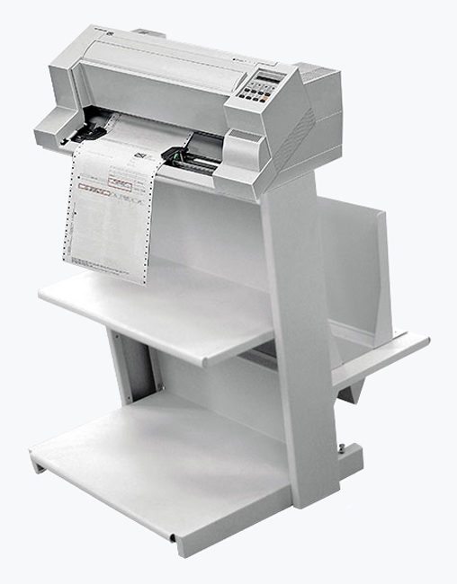
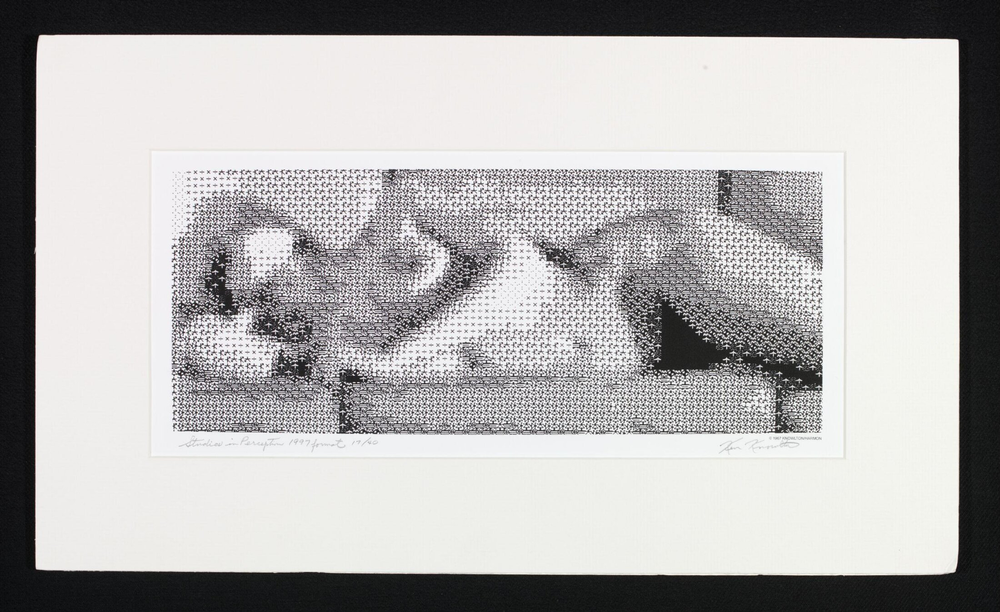
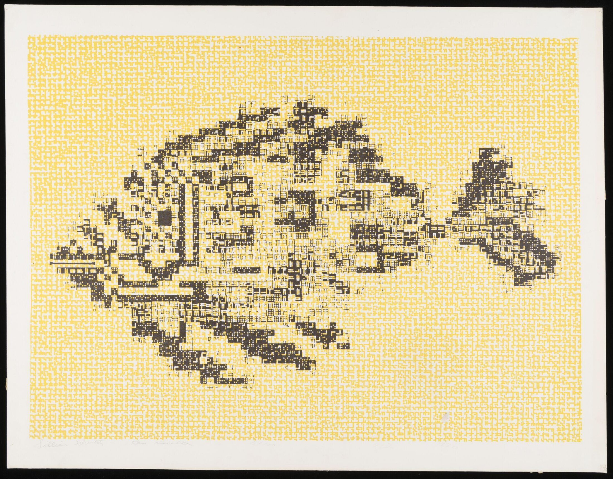
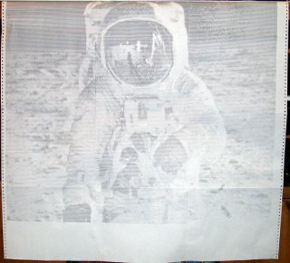
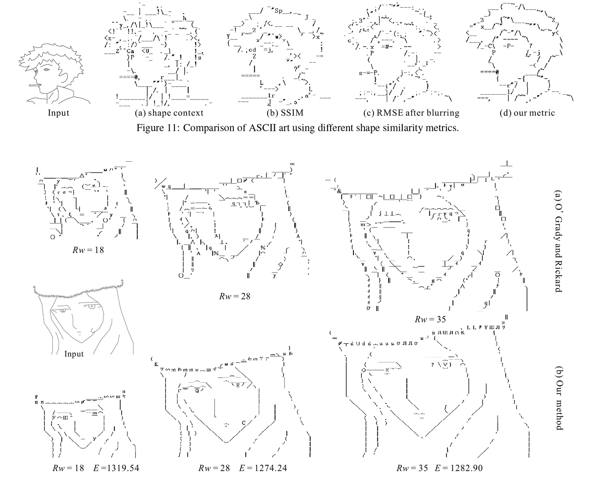

# RC2026/10: Choosing a Dot Matrix Printer Project

I've got a PSi PP404 sat on the desk — a proper industrial wide-carriage line printer — a decent stack of
fanfold paper, and two fresh ribbons. All I lacked was a plan. With Retrochallenge 2026/10 starting in
October, I spent an evening at the end of September brainstorming ideas with Claude to see what a fast,
industrial 24-pin printer paired with an emulated retro computer could actually do.

This post summarises that session: seven starter ideas, with the throwaway "big graphics" suggestion
resulting in a research rabbit hole that ended up shaping this month's project.


_The PP404, ready for a month of paper_

## The Printer

The PP404 isn't a home printer, it's a PSi flatbed machine built for lists, barcodes, labels and multi-part
formsets — with zero tear-off so it doesn't waste a form between jobs — exactly the sort of industrial
overkill that makes for a good Retrochallenge entry. I double-checked the numbers below against PSi's own
datasheet and operator's guide, both bundled as reference material in the [escp](https://github.com/urbancamo/escp)
project.

It's a **24-wire serial impact dot matrix printer**, the needle diameter 0.25mm, with a printhead rated for
400 million characters and a nylon ribbon cassette good for around 16 million of them. Rather than one
speed it has three quality tiers: draft (DQ) at 500 cps, near letter quality (NLQ) at 250 cps, and full letter
quality (LQ) at 125 cps, measured at 10 cpi — 470, 350 and 210 pages an hour respectively on fanfold. It
can lay down an original plus five copies in one pass (up to 0.5mm total thickness), pulls fanfold paper
from 4 to 16 inches wide at 11 inches/second, and is rated for 20,000 pages a month.

Print format is 136 characters at 10 cpi, with pitches up to 20 cpi (and 17.1 cpi condensed) also available,
and line spacing adjustable from 2 up to 360 lpi — plenty of room for the sub-cell positioning idea below.
Graphics run at 360×360 dpi, uni- or bi-directional, and there are 13 resident barcode symbologies (EAN,
UPC, Code 39/93/128, Postnet and others) alongside 14 built-in fonts, including three block-character
"data" fonts meant for draft-quality forms.

Connectivity is Parallel IEEE1284, Serial RS-232C/RS-422, and USB 2.0 — no Ethernet, so anything
network-shaped would need a serial or USB print server in between. Most usefully for this project, it
emulates four different printer languages, switchable by macro or from the operator panel: **Epson
LQ 2550/1060 with ESC/P2**, **IBM Proprinter**, **IBM Proprinter XL24 (AGM)**, and **Philips GP** — which
is what makes it a plausible target for practically any emulated 1980s computer's printer driver.

Sources: [Argecy](https://www.argecy.com/pp404),
[PSi Matrix](https://psi-matrix.eu/en/dot-matrix-printer-linematrix-printer-lineprinter-line-printer-industrial-printer-label-printer/pp404/),
[PP404 technical datasheet (PDF, via escp)](https://github.com/urbancamo/escp/blob/main/reference/pp404/PSI_PP404.pdf)

## Seven Starter Ideas

### 1. A VAX with a Hardcopy Console

Run OpenVMS under SIMH and route the operator console to the PP404, so it behaves like it has a DEC
LA36 DECwriter hanging off it — every boot message, OPCOM alert and login lands on paper as it
happens. Add an LP11 line printer device on top and you get proper `PRINT/FLAG` banner pages and
132-column MACRO-32 listings with cross-references. At the end of the month, the physical console log
becomes the write-up.


_A DEC LA36 DECwriter — the role the PP404 would play as a VAX's paper console (Wikimedia Commons, CC BY-SA 3.0/GFDL)_

### 2. A Live RTTY Teleprinter

The radio tie-in: decode RTTY with `fldigi`, feed the text to an emulated machine or a small teleprinter
program, and print it live. Shortwave weather RTTY broadcasts and RTTY contests are both good sources,
worth checking schedules for. As a second strand, vintage RTTY art — the pictures radio amateurs sent by
teleprinter in the '60s and '70s — could be collected and reprinted.


_An ASR-33 Teletype terminal — the classic teleprinter the PP404 would be standing in for (Photograph by Rama, Wikimedia Commons, CC BY-SA 2.0 FR)_

### 3. A Commodore Printer Translator

VICE can send device 4 output to a file or a raw device, but Commodore MPS-801/803 graphics and PETSCII
don't match Epson ESC/P. Writing a converter from MPS to ESC/P would let Print Shop banners, GEOS
documents and Newsroom pages print correctly on the PP404 — a 6-metre Print Shop banner on continuous
paper would make a good photo in its own right.


_The Commodore MPS-801 — its graphics mode doesn't map cleanly onto Epson ESC/P (Wikimedia Commons, public domain)_

### 4. A Chart Recorder

Have an emulated machine (a BBC Micro, CP/M BASIC, or a C64) sample something slow and print one line
every so often, like a pen recorder. Candidates include band activity from an SDR as a character waterfall,
solar flux, or temperature — the paper becomes a month-long timeline.

### 5. A Retro Logbook and QSL Labels

Export an ADIF log — my own [ADIF Processor](https://www.adif.uk) would do the job — and print it from
an emulated CP/M or Z88 program in a classic greenbar logbook layout. The printer's barcode and label
abilities could then produce QSL labels with a Code 39 or 128 barcode of the QSO, with multi-part paper
giving a "carbon copy" station log.

### 6. Big Graphics at 132 Columns

A Mandelbrot or other plot in 24-pin bit-image mode at 360×360 dpi, drawn by an emulated 8-bit machine
and running across several fanfold pages. 

### 7. Z88 with PipeDream

Run the Cambridge Z88 in OZvm, use its printer driver editor to build a driver for the PP404's escape codes,
and print PipeDream spreadsheets. A small project, but one that ties in neatly with Z80 work already done
for other parts of this site.


_The Cambridge Z88 — small, Z80-based, and bundled with the PipeDream spreadsheet/word processor (Wikimedia Commons)_

### Getting the Data to the Printer

This part is already solved. The PP404 talks Parallel, Serial (RS-232C/RS-422) or USB, and defaults to
Epson LQ/ESC/P2 emulation, so my [escp](https://github.com/urbancamo/escp) project — a small C99
command-line filter, built with the PP404 specifically in mind — handles it: initialisation, pitch and font
selection, bold/underline/italic, draft or letter-quality mode, form feeds and raw byte injection, all
composable on one command line and written straight to stdout. A companion tool, `escpmd`, does the
same starting from a Markdown document. Piped straight to the printer's device node, it means none of
these projects need to reinvent ESC/P generation from scratch:

```bash
# initialise the printer, set pica pitch, print a line, form feed
escp --init --pica --text "N-Queens Solution 1" --ff > /dev/usb/lp0

# or, via escpmd, straight from a Markdown source file
escpmd listing.md > /dev/usb/lp0
```

The front-runner after the first pass was combining the VAX hardcopy console with the RTTY teleprinter —
both are very visual, both are strongly period, and together they'd use a satisfying amount of paper. But
idea 6 turned out to have more to it than expected.

## Down the ASCII Art Rabbit Hole

The PP404 can space lines finely and pack characters tightly, so I asked Claude to dig into how far anyone
had taken character-based image generation — properly researched, not just Mandelbrot plots. Bit-mapped
graphics were an option too, but ASCII felt more in keeping with the machine. What came back was a
potted history running from a man with cerebral palsy and a typewriter, through Bell Labs and Princeton, to
a SIGGRAPH paper from 2010 — and a genuine gap in the middle of it that the PP404 happens to be well
suited to filling.

### Typewriter Art, by Hand

The earliest ceiling on this kind of thing was set by a person, not a computer.
[Paul Smith](https://en.wikipedia.org/wiki/Paul_Smith_(artist)) (1921–2007), who had cerebral palsy,
taught himself to make images using only the ten symbol keys on the top row of a typewriter. He got
different textures from different symbols, built depth by varying the spacing between characters, and
controlled line spacing by moving the roller by hand between lines — essentially a manual version of the
fine line-spacing control the PP404 offers. His portraits, done freehand over weeks, are still the benchmark
for how photographic character art can look.

Well worth a watch: footage of Paul Smith actually at work is quite amazing.

[](https://www.youtube.com/watch?v=svzPm8lT36o)

_Paul Smith at his typewriter — click to watch on YouTube_

### Mainframe Line-Printer Art (1960s–70s)

Knowlton and Harmon's
[*Studies in Perception I*](https://collections.vam.ac.uk/item/O1488651/studies-in-perception-i-screenprint-ken-knowlton/)
(1966) is the landmark computer-generated piece: a photograph of the dancer Deborah Hay, reduced to a
grid of grey squares and printed using symbols borrowed from telephony circuit diagrams. The result was
12 feet wide and was first hung in a colleague's office at Bell Labs as a prank. It used symbol substitution
with no overstrike.





Overstrike — striking more than one character in the same position to build up tone — became the main
technique soon after.

[Samuel Harbison](https://q7.neurotica.com/Oldtech/ASCII/) at Princeton, in the early 1970s, linearly
mapped image density between a black and white cutoff onto around 16 overstrike patterns to form a
printer greyscale. His largest piece was roughly four feet square and looked best from about 20 feet away;
an overstrike Mona Lisa of his circulated on DECUS tapes among minicomputer users, and his original files
survive today on a PDP-8 archive site — real 1970s source data that could, in principle, be reprinted as-is.



### The Modern Revival

[Hugh Pyle's ASR-33 work](https://hughpyle.com/ASR33/) is the most rigorous modern treatment of
overstrike: he printed and scanned a table of every two-character overstrike combination on real Teletype
hardware, then matches source images against that table using both luminance and edge orientation. It's
the current practical state of the art on physical hardware, though limited to 72 columns, uppercase only,
and a fixed platen — all constraints the PP404's wider carriage and finer paper feed could push past.
His code is on [GitHub](https://github.com/hughpyle/ASR33/blob/master/asciiart/README.md).

### The Academic Frontier

Research has since moved from matching tone to matching shape.
[Xu, Zhang and Wong's SIGGRAPH 2010 paper](https://history.siggraph.org/learning/structure-based-ascii-art-by-xu-zhang-and-wong/)
points out that tone-based methods produce halftone-like results and need high text resolution, and
instead fits an image's line structure to the shapes of the characters themselves. Follow-up work and
recent machine-learning comparisons build on the idea — but all of it assumes one character per fixed
grid cell on a screen.



### Where the Gap Is

Nobody found in this research combines all three of the following:

1. **Overstrike stacks** — several glyphs struck in one cell, as Harbison and Pyle do.
2. **Sub-cell positioning** — moving the paper by 1/216 inch (`ESC J n` in ESC/P) and shifting glyphs
   horizontally by fractions of a character (`ESC \`), so glyphs don't have to sit on a grid. It's Paul Smith's
   roller technique, done by machine.
3. **Structure-aware matching** — using the shapes of `/ \ | _ ( )` to draw edges, in the spirit of the
   SIGGRAPH work, with tone filled in between them by overstrike.

Line printers and Teletypes can't do the second of these, and screen-based research doesn't do the first or
second. The PP404 can do all three, and 136 columns at 10 cpi — more than 270 at maximum condensed
pitch — gives plenty of resolution to work with.

### The Plan for October

- **Week 1 — characterise the printer.** Print a calibration sheet of every printable glyph, every
  two-glyph overstrike, and some glyphs at sub-cell offsets, then scan it at high resolution. That gives the
  actual ink footprint of each glyph on the current ribbon, which works better than a font-based guess.
- **Week 2 — build the renderer.** On a modern machine, write a greedy or annealing optimiser that
  places glyph "stamps" (glyph plus x/y offset) to minimise the difference from a target image, with edges
  weighted using the structure-based approach. Output is plain ESC/P text and positioning commands —
  no bit-image mode — to keep it within the ASCII rules.
- **Week 3 — add the retro part.** Replay the generated stream from an emulated machine — a small
  VAX program under SIMH, say, or CP/M BASIC reading the file and sending it to `LST:`. Then reprint one
  of Harbison's 1973 files as-is, next to a version of the same subject through this pipeline, to compare
  fifty years of progress side by side.
- **Week 4 — go big.** Print a multi-sheet mural across the full width of the carriage, tiled Harbison-style
  and taped together.

One practical note that came out of the session: ribbon wear will affect the calibration table from week 1,
so a fresh ribbon goes on before calibrating, with the spare kept back for the final print.

## Where This Leaves Things

This lines up neatly with the goal already set for this entry — pushing dot matrix printing as far as it'll go,
ASCII art included — so the overstrike/sub-cell/structure-matching project above is the plan for October.
The VAX hardcopy console and RTTY teleprinter ideas haven't gone away either; if there's time left in the
month, either would make a nice second act. Source code, as it lands, will be in the companion
[rc2026_10](https://github.com/urbancamo/rc2026_10) GitHub repository.

## Sources

- [PSi Dot Matrix Printer PP404 – Argecy](https://www.argecy.com/pp404)
- [PSi PP404 – PSi Matrix](https://psi-matrix.eu/en/dot-matrix-printer-linematrix-printer-lineprinter-line-printer-industrial-printer-label-printer/pp404/)
- [escp – ESC/P command-line generator for the PP404 – GitHub](https://github.com/urbancamo/escp)
- [Paul Smith (artist) – Wikipedia](https://en.wikipedia.org/wiki/Paul_Smith_(artist))
- [Studies in Perception I – V&A](https://collections.vam.ac.uk/item/O1488651/studies-in-perception-i-screenprint-ken-knowlton/)
- [Studies in Perception restoration – Jim Boulton](https://jimboulton.medium.com/studies-in-perception-a-restoration-story-241cd8c75ab1)
- [Samuel Harbison interview – q7.neurotica.com](https://q7.neurotica.com/Oldtech/ASCII/)
- [Art1 by Richard Williams – GitHub](https://github.com/ef1j/Art1)
- [hughpyle/ASR33 asciiart README – GitHub](https://github.com/hughpyle/ASR33/blob/master/asciiart/README.md)
- [Printing, Typing, Overstriking – Hugh Pyle](https://hughpyle.com/ASR33/)
- [Structure-based ASCII art – SIGGRAPH history](https://history.siggraph.org/learning/structure-based-ascii-art-by-xu-zhang-and-wong/)
